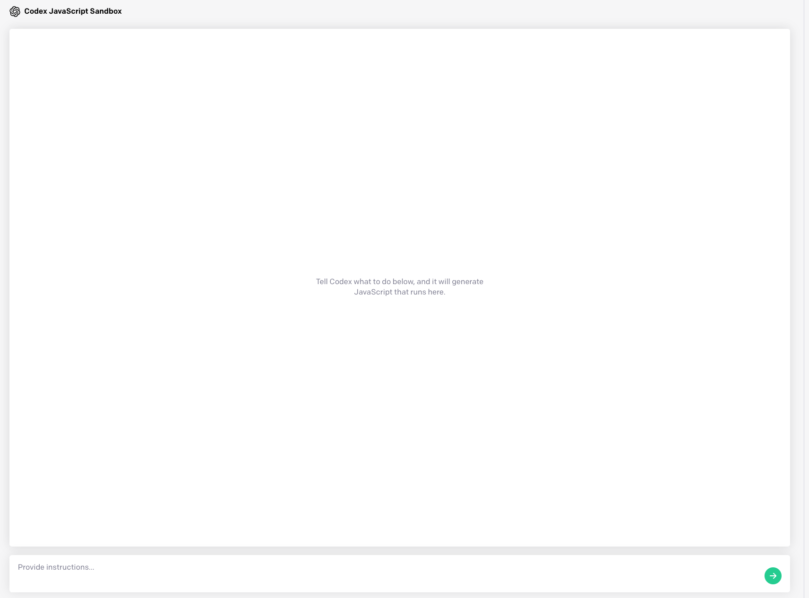

# **GitHub Copilot介绍**
 
 

 
 

GitHub Copilot 从您正在处理的代码中提取上下文，建议整行或整个函数。 它可以帮助您快速发现解决问题、编写测试和探索新 API 的替代方法，而无需在互联网上繁琐地搜索答案。 在您键入时，它会适应您编写代码的方式——帮助您更快地完成工作。

1. GitHub Copilot 现在处于技术预览 ， 你可以该链接进行申请: https://github.com/features/copilot/signup 

2. 通过 Visual Studio Code 你可以安装 Visual Studio Code Copilot 插件
 
 

 
 
3. Copilot 除了支持 Visual Studio Code 外 ， 还支持 Visual Studio 和 JetBrains 系列的开发工具 (IntelliJ 和 PyCharm 2021.2 以上版本）
 
 

GitHub Copilot 源于 Open AI 的 Codex 模型 。 而 Codex 是 GPT-3 演化进来 ，GPT-3 通过自然语言和数十亿行代码的训练。 它最擅长 Python，并精通十多种语言，包括 JavaScript、Go、Perl、PHP、Ruby、Swift、TypeScript、SQL 甚至 Shell。 

我们可以通过 GitHub Copilot / COdex  用于各种任务，包括：

将注释变成代码

在上下文中完成您的下一行或功能

为您带来知识，例如为应用程序查找有用的库或 API 调用

添加评论

重写代码以提高效率
 
 

## **体验一下 Codex**
 
 

要使用 Codex 你需要注册一个 OpenAI 账号 ，并申请 GPT-3 使用权具体请参考 ( https://beta.openai.com/docs/guides/code ) 注册成功后，我们可以通过 Open AI  Playground 来做一些测试（ https://beta.openai.com/playground ）
 
 

 
 

###  **来做一个实验**

 
 
按顺序输入以下指令：
 
 
1. Display image from https://miro.medium.com/max/1166/1*0dOJefGU-GtZNMadS_WZkw.png
2. Make it 30%
3. Make the cat black and white
4. make it bounce around the screen
 
 

 
 
我们在没有写代码的情况下完成了一个非常棒的 javascrtipt 代码 

