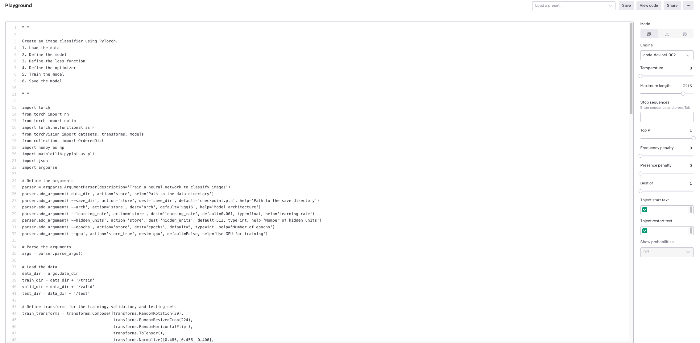

# **Python应用实验**
<br/>

## **实验一**
<br/>

在 lab2 文件夹下创建一个 demo.py  依次输入以下语句

1. show image in a current foloder
2. displaying a Matplotlib Image from current folder cat.jpeg
3. make img a numpy array
4. Make img to black and white 
5. resize img to 128*128
   
<br/>

**结果如下：**

<br/>

<br/>
<br/>

## **实验二** 
<br/>
<br/>

在 lab2 文件夹中创建一个 demo2.py 输入如下
<br/>
<br/>


1. 


```python

'''

function to unzip a file

'''
import zipfile
import os
import sys
import shutil

```

<br/>


2. 

```python


'''

function to zip a file


'''

```

<br/>
<br/>


<br/>
<br/>

## **实验三** 

<br/>
<br/>

```python

"""

Create an image classifier using PyTorch.
1. Load the data
2. Define the model
3. Define the loss function
4. Define the optimizer
5. Train the model
6. Save the model

"""


```


<br/>
<br/>


