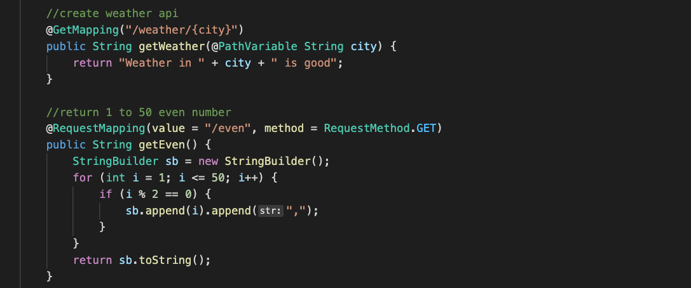
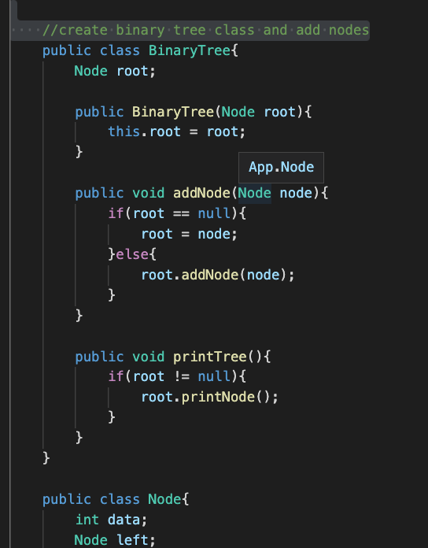
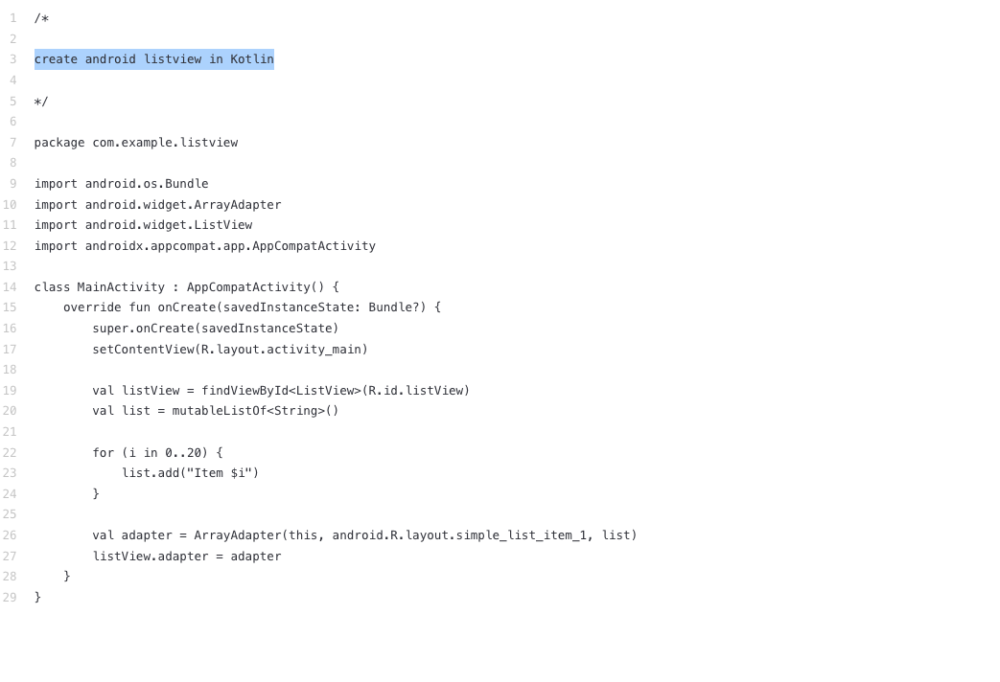

# **Java 应用实验**
<br/>

## **实验一**
<br/>

1. 通过 Visual Studio Code 创建一个 Spring Boot 的项目

2. 创建成功后 ，创建一个 APIController.java 文件

3. 输入如下命令 

```java

//create weather api  

//return 1 to 50 even number

```

<br/>
<br/>

<br/>
<br/>

## **实验二**
<br/>

1. 通过 Visual Studio Code 创建一个 Java 项目 

2. 创建成功后输入如下语句


```java

    //create binary tree class and add nodes

```

<br/>
<br/>

<br/>
<br/>


## **实验三**
<br/>

1. 输入以下命令
```java

    //create android listview in Kotlin

```

<br/>
<br/>

<br/>
<br/>


