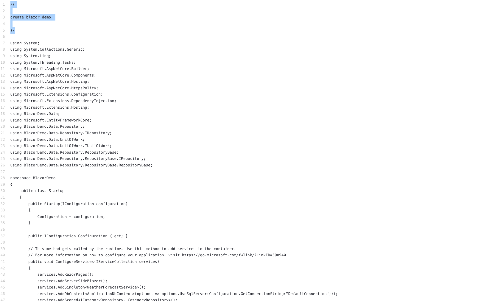
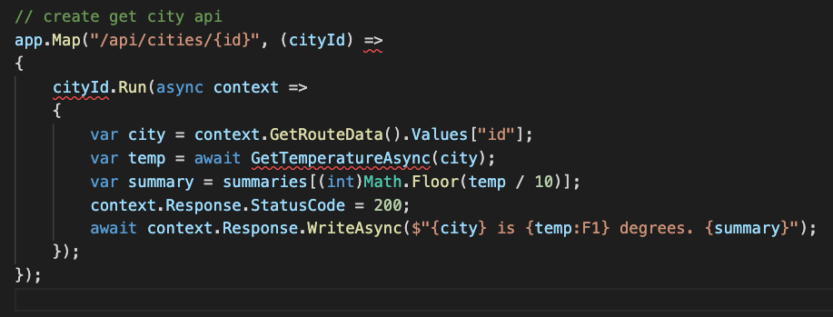

# **C# 应用实验**
<br/>

## **实验一**
<br/>
<br/>

1. 输入如下命令 

```csharp

/*

create blazor demo 

*/


```


<br/>
<br/>

<br/>
<br/>


## **实验二**
<br/>
<br/>

1. 命令行创建一个 .NET 6 的 Minimal API
<br/>
<br/>


```bash

dotnet new webapi -minimal -o apidemo


```

2. 在 Program.cs 文件 添加如下命令
<br/>

```csharp

/*

create get city api

*/


```
<br/>
<br/>

<br/>
<br/>
