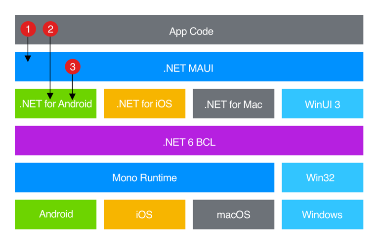

# **.NET 跨平台移动开发**

.NET 多平台应用 UI (.NET MAUI) 是一个跨平台框架，用于使用 C# 和 XAML 创建本机移动和桌面应用。

**注意：MAUI现阶段在预览，本手册下的所有实验都基于 Preview 13**
 
 

 
 

.NET MAUI是开源的，是 Xamarin.Forms 的演变，从移动方案扩展到桌面方案，UI 控件从基础重新生成，以提高性能和扩展性。 如果以前使用过 Xamarin.Forms 生成跨平台用户界面，则你会发现与 Xamarin.Forms .NET MAUI。 但也有一些差异。 使用.NET MAUI，可以使用单个项目创建多平台应用，但如有必要，可以添加特定于平台的源代码和资源。 实现此.NET MAUI一个目标是使你在单个基本代码中实现尽可能多的应用逻辑和 UI 布局。

 

##  **MAUI 工作原理**

 
.NET MAUI将 Android、iOS、macOS 和 Windows API 统一到单个 API 中，该 API 允许随处运行一次开发人员体验，同时提供对每个本机平台的各个方面的深入访问。

.NET 6 提供了一系列特定于平台的框架用于创建应用：.NET for Android、.NET for iOS、.NET for macOS 和 Windows UI 3 (WinUI 3) 库。 这些框架都有权访问 BCL 中相同的 .NET 6 基类 (库) 。 此库从代码中抽象出基础平台的详细信息。 BCL 依赖于 .NET 运行时为代码提供执行环境。 对于 Android、iOS 和 macOS，环境由 Mono（.NET 运行时的实现）实现。 在Windows，Win32 提供执行环境。
 
 

 
 
.NET MAUI PC 或 Mac 上编写应用，并编译为本机应用包：

1. 使用 .NET MAUI 构建的 Android 应用从 C# 编译为中间语言 (IL) ，然后在应用启动时 (JIT) 实时编译为本机程序集。

2. 使用 .NET MAUI 构建的 iOS 应用完全提前 (AOT) C# 编译为本机 ARM 程序集代码。

3. 使用 .NET MAUI 构建的 macOS 应用使用 Apple 提供的解决方案，该解决方案将使用 UIKit 构建的 iOS 应用引入桌面，并按需要通过其他 AppKit 和平台 API 来增强它。

4. Windows 使用 .NET MAUI 构建的 Windows UI 3 (WinUI 3) 库创建面向 Windows 桌面的本机应用。

 

##  **MAUI 的 RoadMap**

 
现阶段的 MAUI 最新版本是 Preview 14 ， 2022 年 4 月会有 RC ，在 2022年 Q2 会有正式版本。
 
 

  
各位可以访问一下链接访问该地址：  <a href="https://github.com/dotnet/maui/wiki/Roadmap">https://github.com/dotnet/maui/wiki/Roadmap</a>
  

 

## **MAUI 开发环境**
 
现阶段 MAUI 比较好的官方体验是在 Visual Studio 2022 的 17.1 或 17.2 预览版本上 。
 

