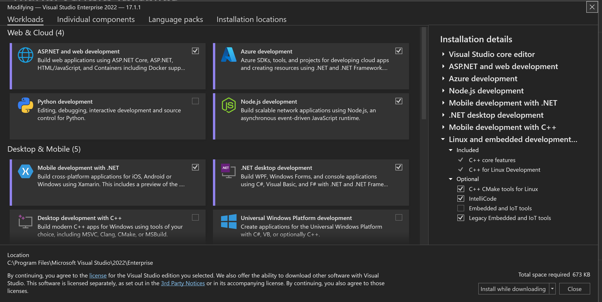
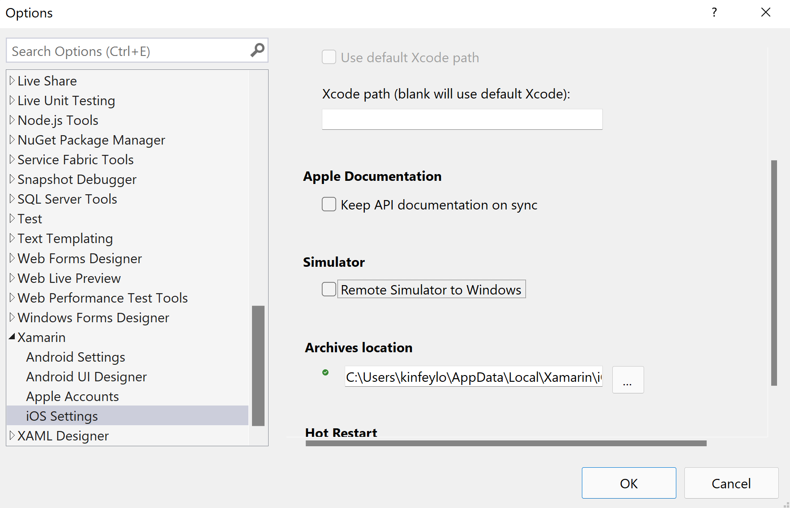
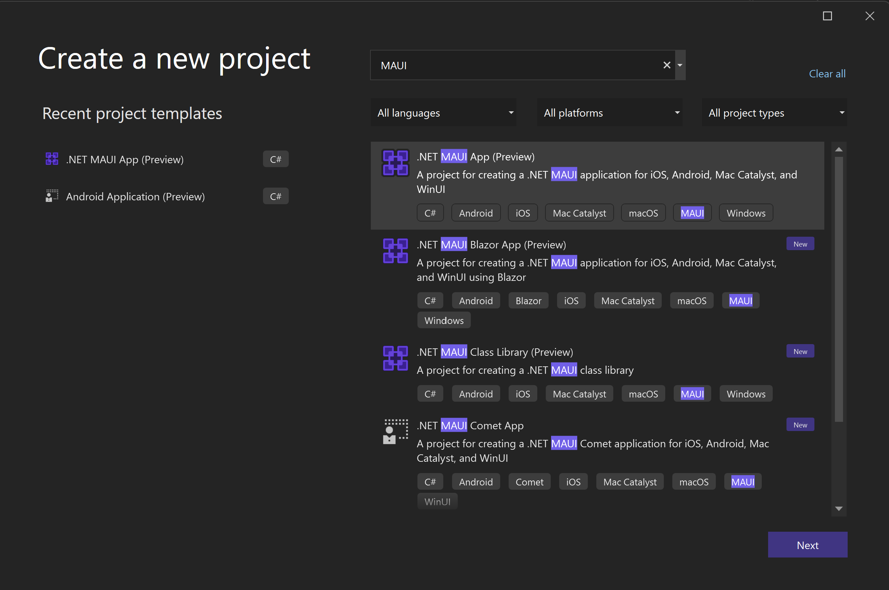
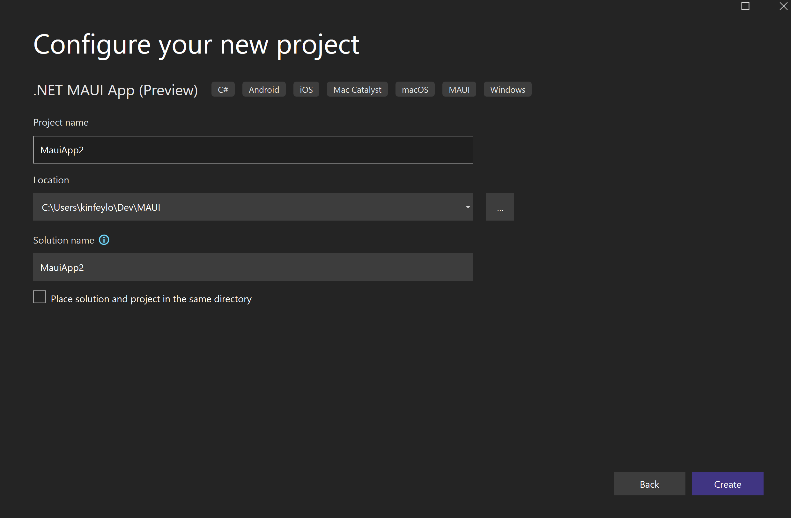
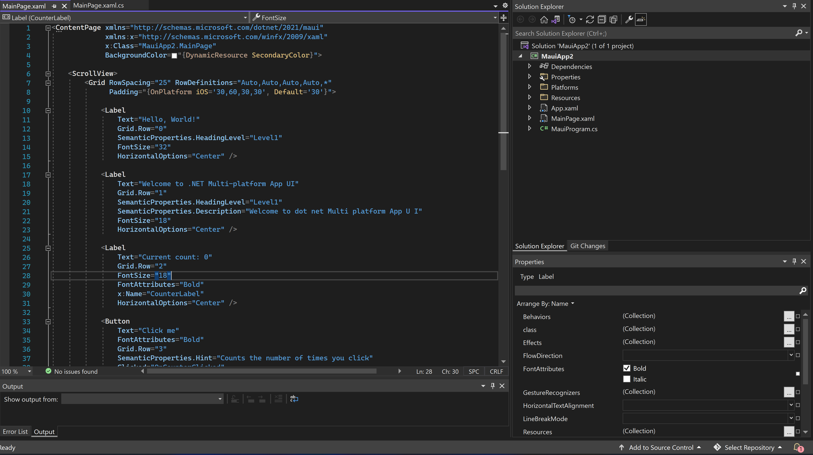
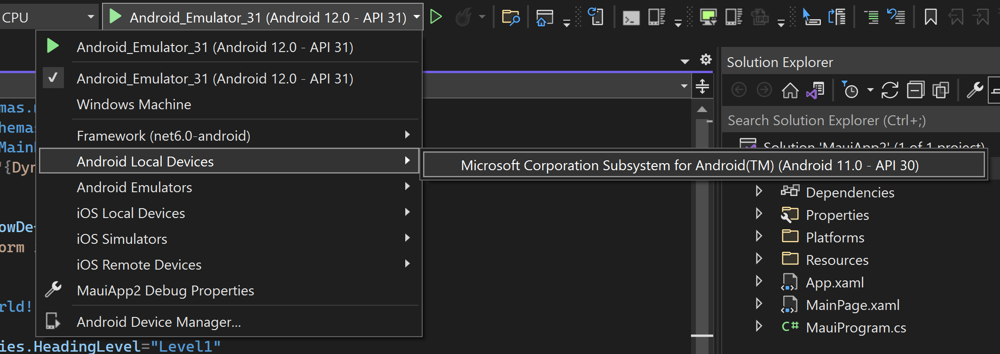
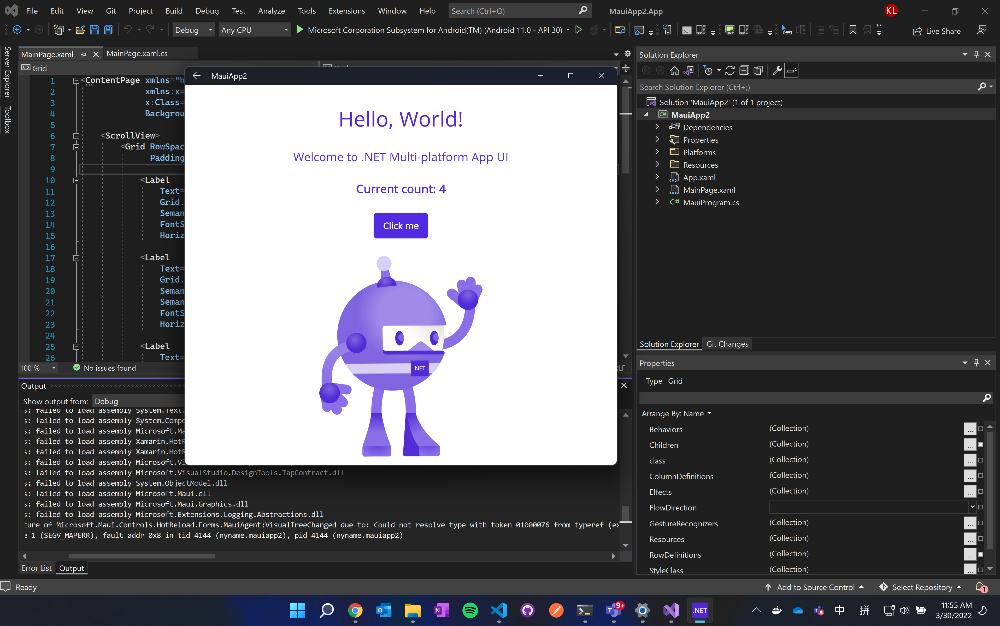
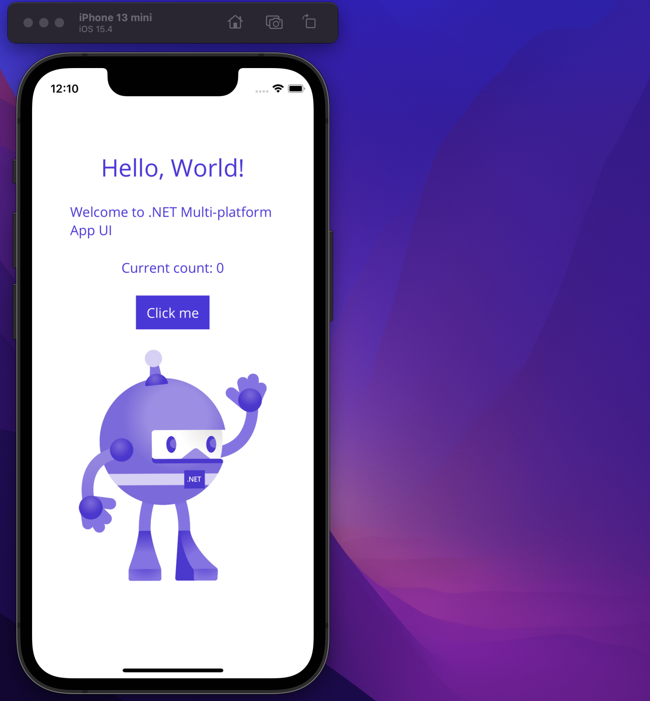

# **MAUI 在 Windows 下 Visual Studio 2022 的开发体验**

## **一. 环境安装**
<br/>

### **Windows下所需要的环境**
<br/>

**Visual Studio 2022 的 17.1.x 或 17.2.x(预览版本)**

安装方法请访问该地址 https://aka.ms/InstallVS 
<br/>
<br/>
安装时必须选择 "Mobile development with .NET"
<br/>
<br/>



**建议使用 Windows 11环境，并安装好 WSA环境**

安装方法请访问该地址 https://docs.microsoft.com/zh-cn/windows/android/wsa/
<br/>

当然你也可以设置安卓环境， 建议在 Android 11 的模拟器下运行

**关于iOS的调试**

1. 你还是必须有一台 macOS 的设备做桥接

2. macOS 必须安装最新的 Xcode 版本

3. dotNET SDK 的版本 macOS 版本和 Windows 上的版本必须一致 ，建议使用 .NET SDK 6.201 这个版本

4. 现阶段桥接远程模拟器调试在 Windows 上黑屏， 建议配置好 Visual Studio MAUI 开发环境后 ，去 Tools -> Options -> Xamarin -> iOS Settings 下的 Simulator 勾选框去掉 
<br/>
<br/>



## **二. 实操案例**

打开 Visual Studio 2022 创建新项目 ， 查找 MAUI ，你可以找到和 MAUI 相关的所有项目

<br/>
<br/>

<br/>
<br/>

这里我们选择 .NET MAUI APP 选择下一步， 创建好相关的保存路径位置和文件名，你就可以创建第一个 MAUI 程序了 

<br/>
<br/>

<br/>
<br/>

**本课程专注在 iOS / Android 平台的知识讲授， Windows / macOS 的相关应用开发请小伙伴自己完成学习**

通过创建，你可以看到好多与熟悉的技术 ， 包括了 C# , XAML 等。

<br/>

<br/>
<br/>

这个时候，你需要调试

1. iOS 调试环境配置请参考 

https://docs.microsoft.com/zh-cn/xamarin/tools/ios-simulator/

2. Android 环境配置 

https://docs.microsoft.com/zh-cn/xamarin/android/get-started/installation/android-emulator/hardware-acceleration?tabs=vswin&pivots=windows

3. WSA 环境启动 , 在 Powershell 环境下输入如下指令

```bash
adb connect 127.0.0.1:58526
```

   58526 端口打开后，你就可以在 Visual Studio 2022 下看到 WSA 的测试环境了
<br/>
<br/>

<br/>
<br/>

4. 尝试选择 WSA 去运行相关项目
<br/>
<br/>

<br/>
**由于在预览版本阶段，不是太稳定，但能体会一下也是非常不错**
<br/>


5. 尝试运行一下 iOS 项目
<br/>
<br/>

<br/>

<br/>
<br/>


