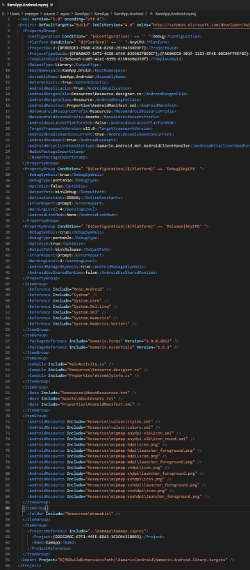

# **MAUI 进阶**


## **MAUI 与 Xamarin 的对比**
<br/>

1. 通过一个项目进行维护， 更容易管理
<br/>


<br/><br/>

2. 资源归一化
<br/>


<br/><br/>

3. 精简的项目描述文件

<br/>
之前在 Xamarin 的描述文件
<br/>
<br/>

<br/><br/>
现在的描述文件
<br/><br/>


<br/><br/>

4. 重新绘制的 UI
<br/>

<br/>
<br/>


## **MAUI 融入到更多的开源和商业项目支持当中**
<br/>

<br/><br/>
这是通过 Blazor 完成混合场景的开发 ，提高了用户体验 
<br/><br/>
打开 Visual Studio 2022 可以选择 MAUI Blazor 应用模版 , 快速创建应用， 你可以作为一名页面前端开发人员来完成具备原生性能的跨平台应用操作
<br/><br/>

<br/><br/> 

<br/><br/> 
基于 MAUI 的变体也有很多， 以 MAUI 做底层也有了不同的衍生跨平台产品 Uno Platform  ， Avalonia 就是其中之一 。
<br/> 
<br/> 
了解 Uno Platform 你也可以访问该网址，获取更多信息 https://platform.uno/  
<br/> <br/> 

了解 Avalonia UI 你也可以访问该网址，获取更多信息  https://github.com/AvaloniaUI/Avalonia
<br/> <br/> 

## **Comet 来了**
<br/>
<b>基于 MAUI 声明式 UI - Comet来了</b>
<br/><br/>
Comet 是一种编写跨平台 UI 解决方案, 通过声明式的 UI 来完成 UI 构建。
<br/><br/>
了解该项目请访问 ：https://github.com/dotnet/comet 
<br/><br/>
<b>什么是命令式UI</b>
<br/>
UI的更新是由程序员使用代码主动刷新，UI与数据并无必然的映射关系，这种我们称之为命令式UI
<br/><br/>

<b>什么是声明式UI</b>
<br/>
UI的更新并非由程序员使用代码来主动刷新，而是由后面隐藏机制来负责维护UI的刷新，UI与数据有映射关系，这种我们就称之为声明式UI

前端开发，原生移动应用开发 iOS/Android ， 桌面端开发都统一属于命令式 UI。

这种命令式UI的模式，是存在一些问题的，表现在：

1. UI 维护成本高， 量大易出错
2. 刷新频繁，性能影响大
3. UI 与数据同步不一致性

声明式 UI 与命令式 UI 相反 

1. UI 一次定义省心，出错机会少
2. 关注数据刷新，降低对 UI 编码量
3. UI 与数据同步一致

现在声明式 UI 用得最好的是 Flutter 以及 ReactNative 还有 SwiftUI , 现在声明式 UI 也来到了 MAUI。

```csharp

public class MyPage : View {
    public MyPage() {
        Body = body;
    }
    View body () => new Text("Hello World");
}

```

<b>新的设计模式</b>
<br/><br/>

<br/><br/> 


