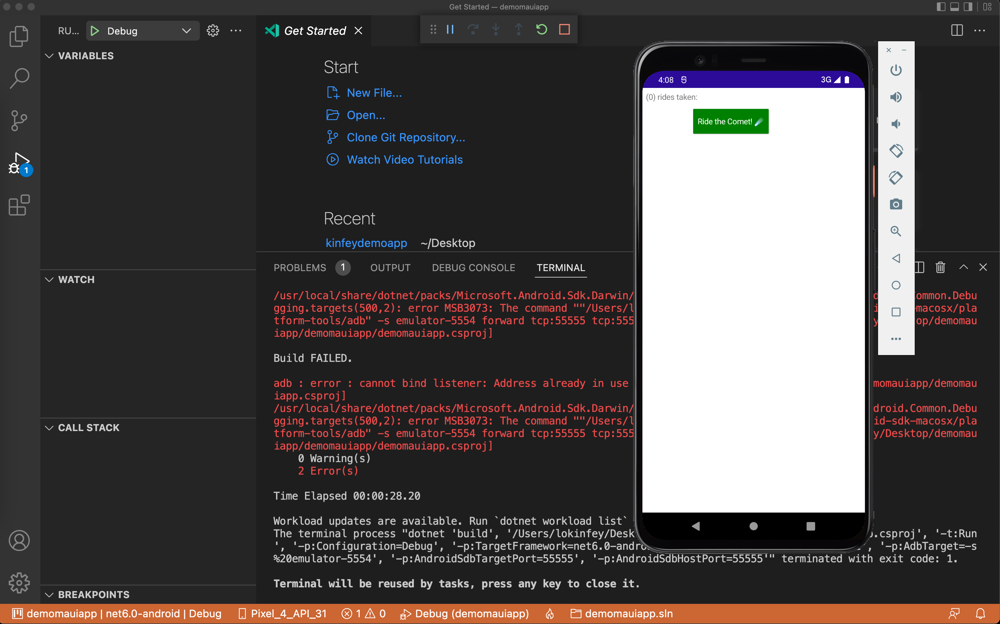

# **Comet 初体验**

## **环境配置**
<br/>


###  **0. 安装好 VS Code Insider**
<br/>

###  **1. 现在Comet 稳定支持 MAUI Preview 13**
<br/>
<b>注意：请再次确保你的 dotNET SDK 6.0.201</b>
<br/><br/>
在 macOS / Windows 命令行下输入如下命令，确保 MAUI 在 Preview 13
<br/><br/>

```bash

dotnet workload install android ios maccatalyst tvos macos maui wasm-tools  --from-rollback-file https://aka.ms/dotnet/maui/preview.13.json  --source https://aka.ms/dotnet6/nuget/index.json  --source https://api.nuget.org/v3/index.json

```

###  **2. 通过dotnet tools 安装 Comet模版**
<br/>
在 macOS / Windows 命令行下输入如下命令
<br/>

```bash

dotnet new -i Clancey.Comet.Templates.Multiplatform

```
<br/>

###  **3. 在 Visual Studio Code 下安装 Comet for .NET 插件**

<br/><br/>

<br/><br/> 


<br/>

###  **4. 热更新组件安装**

<br/>
在 macOS / Windows 命令行下输入如下命令
<br/><br/>

```bash

dotnet tool install --global Reloadify  

```


## **环境配置**
<br/>


###  **1. 创建 Comet 项目**
<br/>

```bash

dotnet new comet -n demomauiapp

```
<br/><br/>

###  **2. 在命令行编译环境**
<br/>
<b style="color: red">重要提示： 
<br/>

a. 因为 Comet 在预览阶段，所以必须在命令行先编译好，否则有可能遇到 VS Code 没办法打开的问题
<br/>

b. 在 macOS 下你可以编译 iOS / Android / macOS 应用程序 ，在 Windows 下 你可以编译 iOS / Android 应用程序 


</b>
<br/>

```bash

dotnet build demomauiapp -t:Build -f net6.0-android
dotnet build demomauiapp -t:Build -f net6.0-ios

```
<br/>

###  **3. 用 VS Code Insider 打开项目**
<br/>
打开后稍等片刻就可以看到完整的 VS Code 项目 ，哈哈哈我们可以用最强编辑器 VS Code 做 dotNET MAUI 跨平台开发了 
<br/><br/>

<br/><br/> 

通过选择左下角的项目，你可以选择在 iOS / Android / macOS 应用进行调试 ，并可以不同设备
<br/>
<br/>

<br/><br/> 

<br/><br/>

<br/><br/> 

<br/><br/> 


<b style="color: red">重要提示： 
<br/>

a. 在 Windows 版本在现阶段只支持 Android 的调试 ， 不支持 iOS 远程调试 <br/>

b. 在 macOS 版本下虽然可以支持 iOS  / Android 部署 ， 但 Android的 Debug 还是存在或多或少问题。 在 Apple M1 环境下暂不支持 Android 设备的调试和部署 <br/>

c. 建议 macOS 调试 iOS , Windows 调试 Android ， 其他用 HotReload 方式解决

d. 建议 Android 调试先把虚拟机打开 ，否则会有出错的机率<br/>
</b>
<br/>

###  **4. HotReload**
<br/>
HotReload 针对界面设置是非常有效的，我修改 UI 元素时就经常用到它

<br/>
使用 HotReload 请在命令行输入如下命令 , 确保应用程序能顺利装上设备

<br/>

<b>iOS HotReload执行</b>
<br/>

```bash

dotnet build demomauiapp -t:Run -f net6.0-ios
reloadify ./demomauiapp/demomauiapp.csproj -t ios

```

<br/>

<b>Android HotReload执行</b>

<br/>

```bash

dotnet build demomauiapp -t:Run -f net6.0-android
reloadify ./demomauiapp/demomauiapp.csproj -t android

```

配置成功后你就可以所改即所得的热更新了

<br/>
<b style="color: red">重要提示： 
<br/>

由于在预览版本， Hot Reload会失效，建议停止后，重新启动<br/>
</b>


