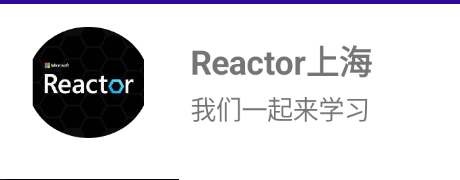
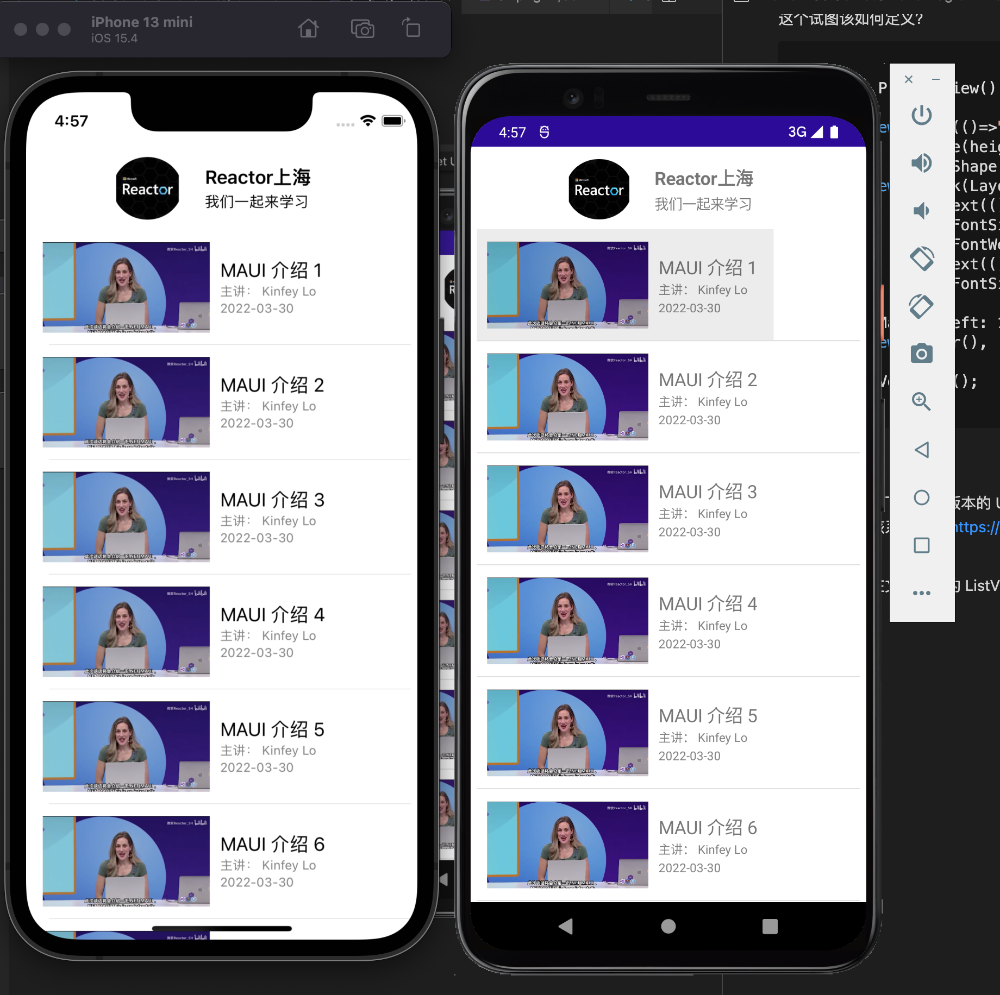
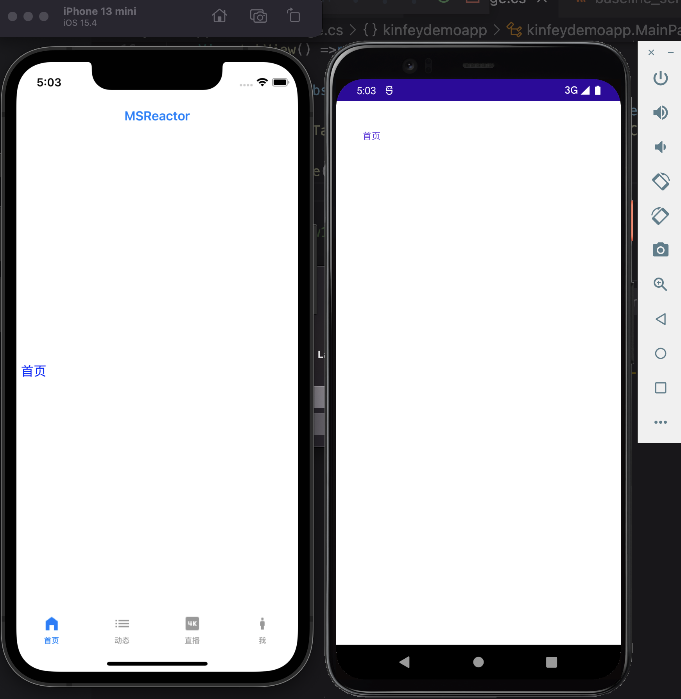

# **Comet UI 与函数式编程**
<br/>

### **函数式编程的由来**
<br/>
函数式编程的编程语言如 Lisp、Clojure、Erlang、OCaml 和 Haskell，它们已被各种组织用于工业和商业应用程序。

<br/>

函数式编程是使用数学函数进行编程。 这个想法是，只要提供相同的参数，数学函数就会返回相同的结果，并且函数的签名必须传达有关它接受的可能输入和产生的输出的所有信息。

<br/>


### **用函数式编程来描述 UI**
<br/>

```csharp

new Button("Ride the Comet! ☄️", ()=>{
	comet.Rides++;
})

```

<br/>
这是和我们传统不一样的方法 ， 更加简洁，而且对于事件的描述更加清晰
<br/>

```csharp


Body = () => new VStack {
	new Image(() => video.Cover).Frame(160, 90),
	new Text(() => video.Title),
	new Text(() => video.Author),
	new Text(() => video.Date),
}.Background(Colors.White);

```


### **Comet UI 介绍**

<br/>

Comet 中的布局从 ContainerView 扩展而来，ContainerView 本身就是一个视图。 这些托管视图在屏幕上排列和分隔子视图，并且都适应应用程序运行的任何大小和密度。 当前的布局视图包括：

<b>HStack、VStack、ZStack</b> - 这些视图将水平、垂直或按 z 顺序显示子视图

<b>Grid、HGrid、VGrid</b> - 这些视图使用强大的列/行系统来排列子视图

<b>ScrollView</b> - 仅包含在可见视口内滚动的单个视图
<br/><br/>

<br/><br/> 

这个试图该如何定义？


```csharp

    View ProfileView() => new HStack
    {
        new Image(()=>"logo.jpeg")
		    .Frame(height: 60, width: 66)
            .ClipShape(new Ellipse()),
        new VStack(LayoutAlignment.Start) {
            new Text(()=> "Reactor上海")
                .FontSize(18)
                .FontWeight(FontWeight.Bold),
            new Text(()=> "我们一起来学习")
                .FontSize(14),
        }
        .Margin(left: 12),
        new Spacer(),

    }.FitVertical();

```

<br/><br/>
这里也得说明一下，预览版本的 UI 还在实现， 现阶段项目组的 David 也发文章介绍 ，建议大家看看该系列文章 https://dev.to/davidortinau/views-in-comet-3cb6  

<br/>

最后运行一下在文件夹下的 ListViewDemo 和 TabDemo 

<b>ListView</b>
<br/><br/>

<br/><br/> 


<b>TabView</b>
<br/><br/>

<br/><br/> 


