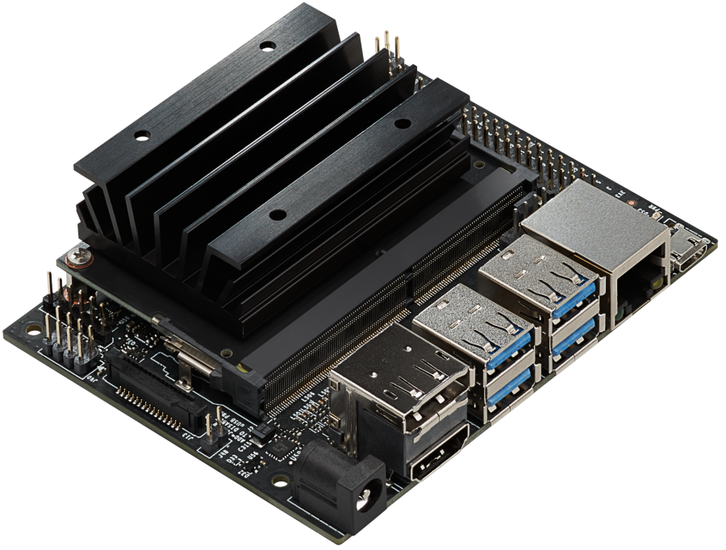
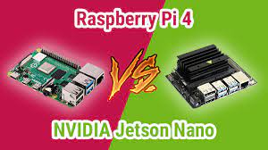
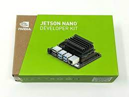
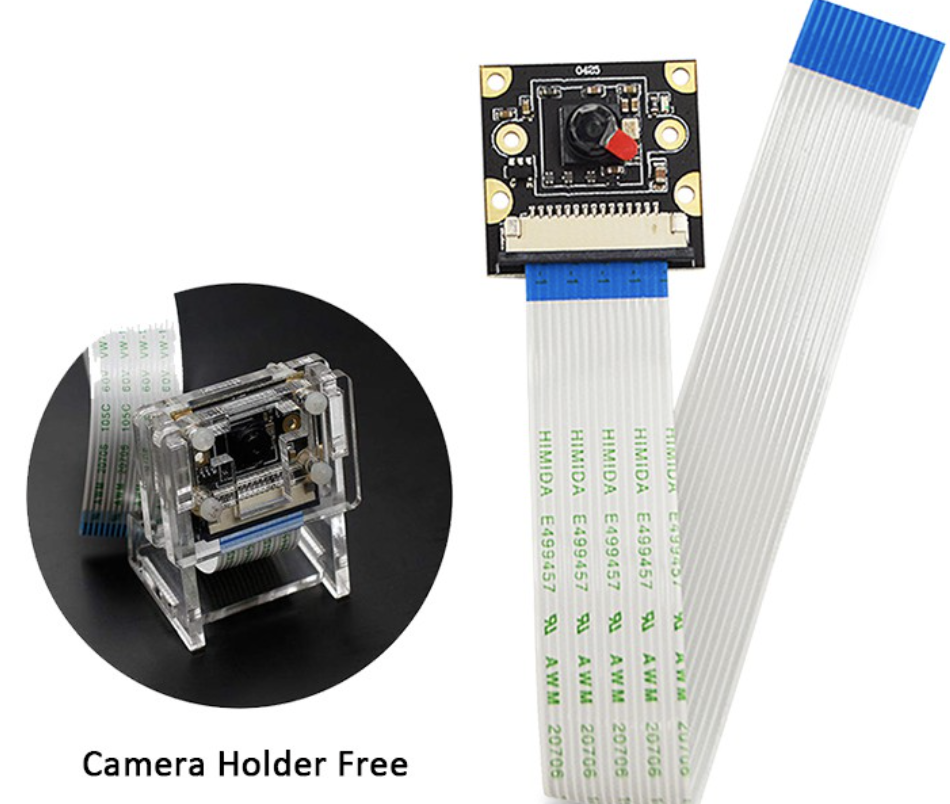
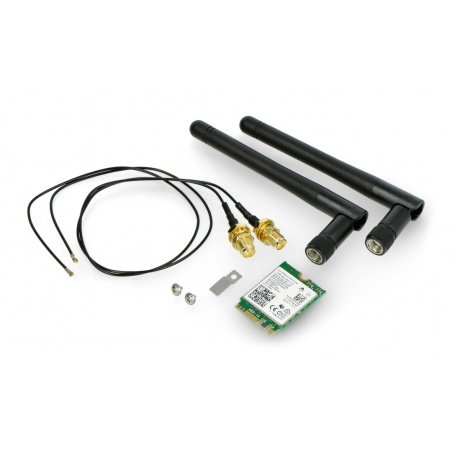
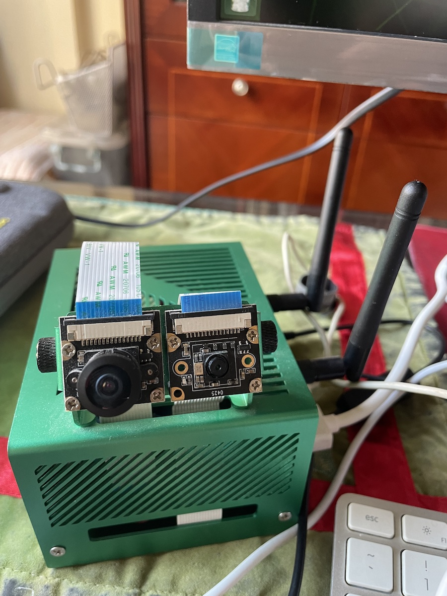

# **00.基本介绍**

## **IoT介绍**

物联网（ IoT ，Internet of things ）即“万物相连的互联网”，是互联网基础上的延伸和扩展的网络，将各种信息传感设备与网络结合起来而形成的一个巨大网络，实现任何时间、任何地点，人、机、物的互联互通。

物联网是新一代信息技术的重要组成部分，IT行业又叫：泛互联，意指物物相连，万物万联。由此，“物联网就是物物相连的互联网”。这有两层意思：第一，物联网的核心和基础仍然是互联网，是在互联网基础上的延伸和扩展的网络；第二，其用户端延伸和扩展到了任何物品与物品之间，进行信息交换和通信。因此，物联网的定义是通过射频识别、红外感应器、全球定位系统、激光扫描器等信息传感设备，按约定的协议，把任何物品与互联网相连接，进行信息交换和通信，以实现对物品的智能化识别、定位、跟踪、监控和管理的一种网络

## **Raspberry Pi or Jetson Nano**
 

### **1. Raspberry Pi介绍**

 

 

树莓派（英语：Raspberry Pi）英国树莓派基金会开发的微型单板计算机，目的是以低价硬件及自由软件促进学校的基本计算机科学教育。树莓派系列计算机每一代均使用博通（Broadcom）出产的ARM架构处理器，如今生产的机型（树莓派4B）内存在2GB和8GB之间，主要TF卡作为系统存储媒体（初代使用SD卡），配备USB接口和HDMI的视频输出（支持声音输出），内置Ethernet/WLAN/Bluetooth网络链接的方式（依据型号决定），并且可使用多种操作系统。产品线型号分为A型、B型、Zero型和ComputeModule计算卡。Raspberry Pi OS是官方推出的操作系统，适用于所有型号的树莓派，树莓派基金会网站也提供了Ubuntu MATE、Ubuntu Core、Ubuntu Server、OSMC等第三方系统供大众下载。

### **2. Jetson Nano介绍**

 

 

Jetson Nano 是一款功能强大的小型计算机，专为支持入门级边缘 AI 应用程序和设备而设计。完善的 NVIDIA JetPack SDK 包含用于深度学习、计算机视觉、图形、多媒体等方面的加速库，可助您快速上手。使用 Jetson Nano 开发者套件开始原形设计，并充分利用我们的合作伙伴生态系统将产品更快地推向市场。

### **3. Jetson Nano or Raspberry Pi?**

 

 

Raspberry Pi 仍然是开发人员、物联网爱好者和开源爱好者的热门选择。Raspberry Pi 拥有庞大的社区支持，这个数字在 reddit 上清晰可见，在 Raspberry Pi subreddit 上超过 210 万。
Raspberry 已在社区中崭露头角。此外，Raspberry 仍然是 Linux 用户的最爱，因为用户有很多安装发行版的选项，从 Ubuntu、Fedora、Raspbian、RISC OS、Windows IOT Core、RetroPi 等，相信我，我只是触及表面，有很多发行版您可以在 Raspberry Pi 上使用，而 Jetson 的官方操作系统是 Linux4Tegra，它基于 Ubuntu 18.04，旨在运行 Nvidia 硬件。

要让 Raspberry Pi 真正与 Jetson 竞争，它只有在添加 GPU 的情况下才有可能。实际上还可以将 GPU 添加到 Pi，但通往它的路径成本更高，因为您必须购买神经计算棒 因此与其投资那么多，不如购买Jetson Nano.

如果您是机器学习爱好者，并且希望您的迷你板来处理数据，那么 Jetson Nano 是完美的选择。随着 GPU 的加入，Jetson 看起来确实很有前景，基准测试的结果不言而喻。

### **4. 关于本次课程的实验**

 

**基于Jetson Nano 4G内存的版本**

 
 
 

**Wifi 模块和摄像头模块**

摄像头模块

 
 
 

Wifi 模块

 
 
 

哈哈，这是我的设备最终形态

 
 
 

