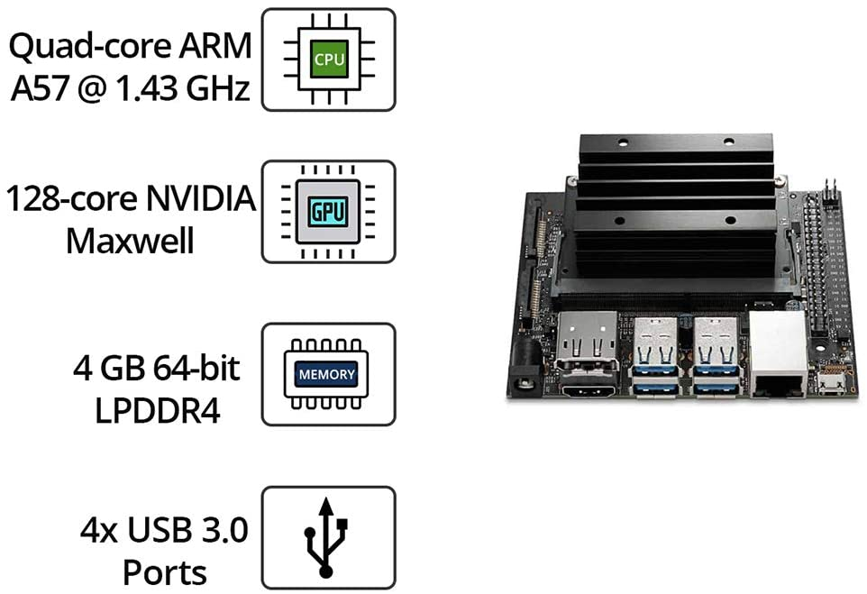
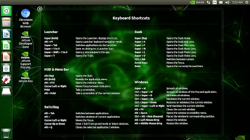
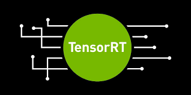
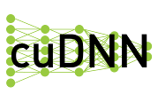
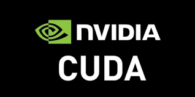
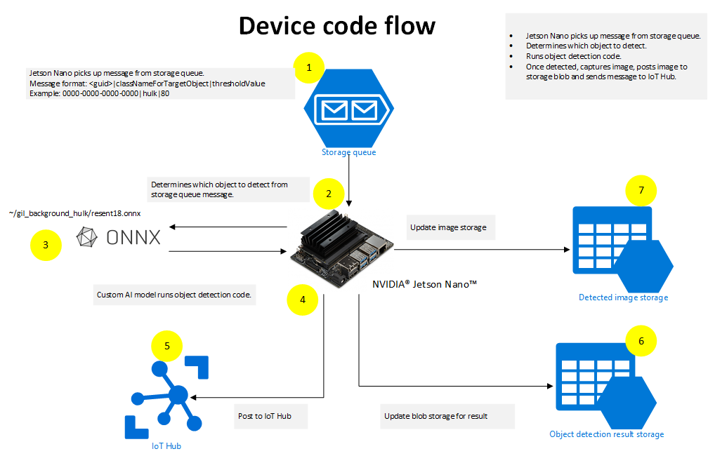

# **01. Jetson Nano 开发者套件学习**

NVIDIA Jetson Nano开发者套件是一款专为创客、学习者和开发者打造的小型 AI 计算机。
  

  

Jetson Nano是英伟达（NVIDIA）公司提供的一款面向AI的高性能低功率的开发板。具有HDMI、DP、以太网口、USB3.0、GPIO等多个接口。它开启了嵌入式物联网应用程序的新领域。Jetson Nano支持高分辨率传感器，可以并行处理多个传感器，并且可以在每个传感器流上运行多个现代神经网络。它内置了英伟达的硬件加速系统和OpenCV，还支持许多流行的人工智能框架，使开发人员可以很容易地将他们喜欢的模型和框架集成到产品中。Jetson Nano使所有人都能更容易地访问人工智能，并由相同的基础架构和软件提供支持。

## **关于 Jetson Nano 的一些相关知识**
 

### **1. JetPack介绍**
 

Jetson Development Pack (JetPack) 是一个按需提供的一体化软件包，捆绑并安装了适用于 NVIDIA Jetson 嵌入式平台的所有开发用软件工具。

JetPack 包括适用于以下功能的工具：

    深度学习：TensorRT、cuDNN、NVIDIA DIGITS 工作流程
    计算机视觉：NVIDIA VisionWorks、OpenCV
    GPU 计算：NVIDIA CUDA、CUDA 库
    多媒体：ISP 支持、摄像头图像、视频 CODEC

同时，它还包括 ROS 兼容性、OpenGL、高级开发者工具等等。现在的 Jet Pack 最新版本是4.6 (关于 JetPack 的版本相关版本介绍请点击<a href="https://docs.nvidia.com/jetson/jetpack/release-notes/"> https://docs.nvidia.com/jetson/jetpack/release-notes/</a>)

JetPack 包括操作系统, TensorRT, cnDNN , CUDA , 多媒体API ， 计算机视觉 ， 开发者工具 ， 支持的 SDK 和工具等。  

### **2. 关于操作系统**
 

 

NVIDIA L4T 提供引导加载程序、Linux 内核、必要固件、NVIDIA 驱动、示例文件系统等内容。  

### **3. TensorRT**
 

 
TensorRT 是用于图像分类、分割和物体检测神经网络的高性能深度学习推理运行时。TensorRT 依托于 CUDA 而构建，是 NVIDIA 的并行编程模型，支持优化各种深度学习框架的推理过程。它包含深度学习推理优化器和运行环境，可让深度学习推理应用实现低延迟和高吞吐量。  

### **4. cnDNN**
 

 
CUDA 深度神经网络库为深度学习框架提供了高性能基元。它可大幅优化标准例程（例如用于前向传播和反向传播的卷积层、池化层、归一化层和激活层）的实施。
  

### **5. CUDA**
 

 
CUDA 工具包为 C 和 C++ 开发人员构建 GPU 加速应用提供了全面的开发环境。该工具包中包括一个针对 NVIDIA GPU 的编译器、多个数学库，以及多款用于调试和优化应用性能的工具。
  

### **6. 多媒体API**
 
Jetson 多媒体 API 包提供了低层级的 API，有助于实现灵活的应用开发。

摄像头应用 API：Libargus 为摄像头应用提供了低层级的帧同步 API，同时还提供了逐帧摄像头参数控制、多个（包含已同步的摄像头）摄像头支持以及 EGL 流输出。需要 ISP 的 RAW 输出 CSI 摄像头可与 Libargus 或 GStreamer 插件配合使用。这两种情况下都会使用 V4L2 媒体控制器传感器驱动 API。

传感器驱动 API：V4L2 API 支持视频解码、编码、格式转换和缩放功能。用于编码的 V4L2 开启了多项功能，如比特率控制、质量预设、低延迟编码、临时折衷、运动矢量图等。
  
### **7. 计算机视觉**
 
VisionWorks 是一个用于计算机视觉 (CV) 和图像处理的软件开发包。
OpenCV 是一个领先的开源库，用于计算机视觉、图像处理和机器学习。
VPI（视觉编程接口）1 是一个软件库，提供可在 PVA2（可编程视觉加速器）、GPU 和 CPU 上实现的计算机视觉或图像处理算法
  

### **8. 开发者工具**
 
CUDA 工具包为 C 和 C++ 开发者利用 CUDA 库构建高性能 GPU 加速应用提供了全面的开发环境。该工具包中包括 Nsight Eclipse Edition、含 Nsight Compute 在内的调试和分析工具，以及用于交叉编译应用的工具链。

NVIDIA Nsight Systems 是一款开销较低的系统级分析工具，可提供开发者分析和优化软件性能所需的见解。

NVIDIA Nsight Graphics 是一款独立应用，用于调试和分析图形应用。
  

## **应用场景**

 

 

