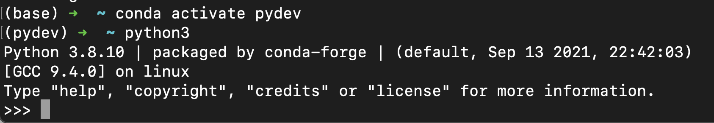

# **02. Jetson Nano 开发环境配置**

## **1. 系统安装**
<br/>

### **建议：64GB以上的告诉SD卡**
<br/>

<b>具体安装请参考:</b><br/><a href="https://developer.nvidia.com/embedded/learn/get-started-jetson-nano-devkit">https://developer.nvidia.com/embedded/learn/get-started-jetson-nano-devkit</a>

## **2. 开发环境搭建**

<br/>

### **Visual Studio Code**

<br/>

<b>安装 ARM 64 位版本的Visual Studio Code:</b><br/>
<a href="https://developer.nvidia.com/embedded/learn/get-started-jetson-nano-devkit">
https://code.visualstudio.com/docs/?dv=linuxarm64_deb</a>
<br/>
<br/>当然别忘记安装Python 插件
<br/><br/>

### **切换成 Oh my zsh**

<br/>

```bash

sudo apt install zsh

git clone https://github.com/ohmyzsh/ohmyzsh.git ~/.oh-my-zsh

cp ~/.zshrc ~/.zshrc.backup

cp ~/.oh-my-zsh/templates/zshrc.zsh-template ~/.zshrc

chsh -s $(which zsh)

```
<br/>
忘记说一点，你可以按照你自己的需要配置更美观的zsh 环境，具体我这里就不多说了
<br/>
<br/>


### **Python**


<br/>
虽然系统自带了 Python，但我还是喜欢用 Miniforge 作为多 Python环境的支持。

关于 Miniforge 的 Github 请点击以下地址获取更多 ： (<a href="https://github.com/conda-forge/miniforge">https://github.com/conda-forge/miniforge</a>)

还有这里对应的 Miniforge 版本aarch64 <br/><br/>

```bash

bash Miniforge3-Linux-aarch64.sh

conda init

```

安装好后你就可以通过conda 安装你所需要的 Python 版本<br/>

如我希望安装Python 的 3.8.10 版本，就可以执行如下操作


```bash

conda create --name pydev

conda activate pydev

conda install -y python==3.8.10

```

<br/>

<br/><br/>


### **关于机器学习相关**
<br/>
在 JetPack 4.6 环境默认的Python已经兼容3.9.x ，但像 TensorFlow 以及 PyTorch 这种库在Jetson Nano 环境下 ，还是3.6.x 的版本, 建议通过 conda 搭建一个 Python 3.6.x 的版本

```bash

conda create --name mldev

conda activate mldev

conda install -y python==3.6.9

```
<br/>

**Tensorflow 安装**

<br/>

<a href="https://docs.nvidia.com/deeplearning/frameworks/install-tf-jetson-platform/index.html">https://docs.nvidia.com/deeplearning/frameworks/install-tf-jetson-platform/index.html</a>

<br/>

**PyTorch 安装**

<br/>

```bash

sudo apt-get install python3-pip libjpeg-dev libopenblas-dev libopenmpi-dev libomp-dev

pip3 install future

pip3 install -U --user wheel mock pillow

pip3 install testresources

pip3 install --upgrade setuptools

pip3 install Cython

pip3 install gdown

gdown https://drive.google.com/uc?id=1TqC6_2cwqiYacjoLhLgrZoap6-sVL2sd

pip3 install torch-1.10.0a0+git36449ea-cp36-cp36m-linux_aarch64.whl

rm torch-1.10.0a0+git36449ea-cp36-cp36m-linux_aarch64.whl

```
<br/><br/>

**机器学习库安装**
<br/>

```bash

conda install -y pandas matplotlib scikit-learn jupyterlab numpy scipy scikit-learn matplotlib pandas pillow graphviz


```

<b>别忘记把cuda环境配置好</b>

```bash

vim ~/.zshrc

# 在zshrc文件下添加如下命令
export PATH=${PATH}:/usr/local/cuda/bin

```


**摄像头**


```bash

gst-launch-1.0 nvarguscamerasrc sensor_id=0 ! 'video/x-raw(memory:NVMM),width=3280, height=2464, framerate=21/1, format=NV12' ! nvvidconv flip-method=0 ! 'video/x-raw, width=816, height=616' ! nvvidconv ! nvegltransform ! nveglglessink -e 

```


<br/><br/>
## **3. 关于环境配置的一些总结**

你把Jetson Nano 看作一个Linux 机器就可以了，也没什么特别，给多点耐心即可