# ** 03. 关于 CustomVision **

微软的认知服务接口，让你可以在零机器学习的知识下，用不同编程语言完成相关的机器学习工作

CustomVision就更进一步，让你在没有编程技术下，完成图像识别和物体识别的工作，他是一个零代码解决方案，你只需要一堆图片集就可以完成工作了，对比起认知服务，你还可以直接导出训练模型，直接部署到不同的场景上

<b>输入以下地址可以进入customvision <a href="https://www.customvision.ai/">https://www.customvision.ai/</a></b>

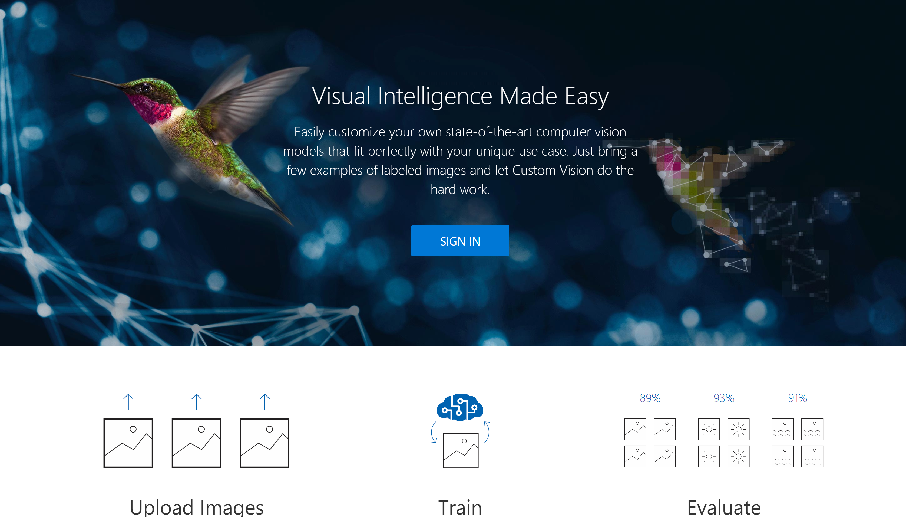  

## **通过低代码方式完成的相关步骤**

### 1. Azure Portal 通过添加资源组，从AI+Machine Learning 创建 Custom Vision
  
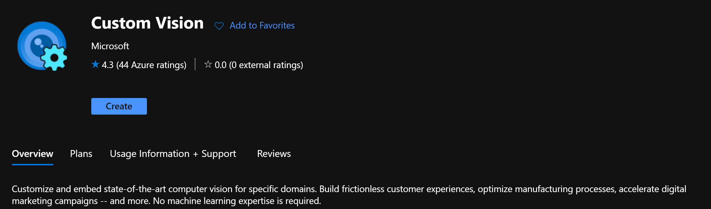  
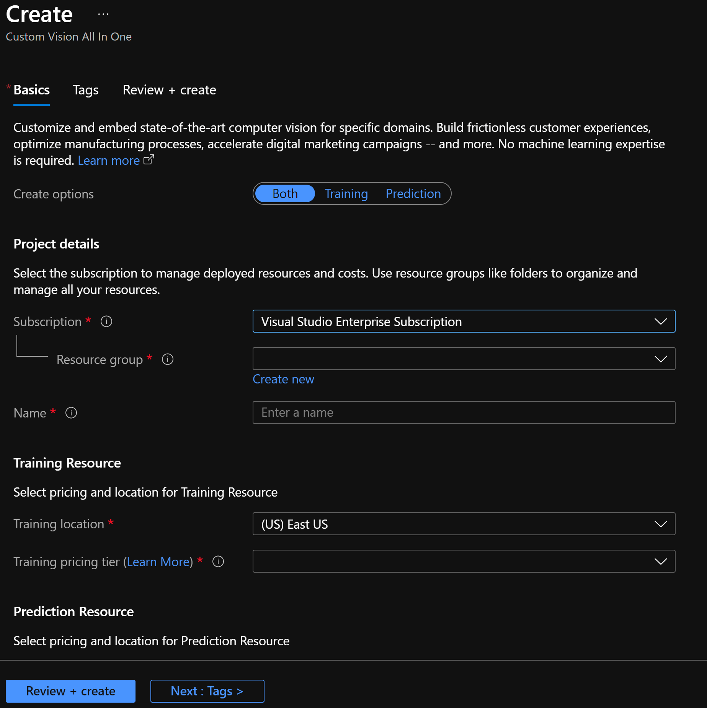  

### 2. 打开Custom Vision网站，登录进入Custom Vision 门户
  
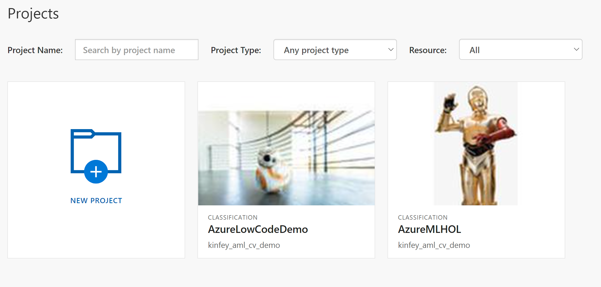
  

### 3. 点击New Project创建你的计算机视觉项目
  
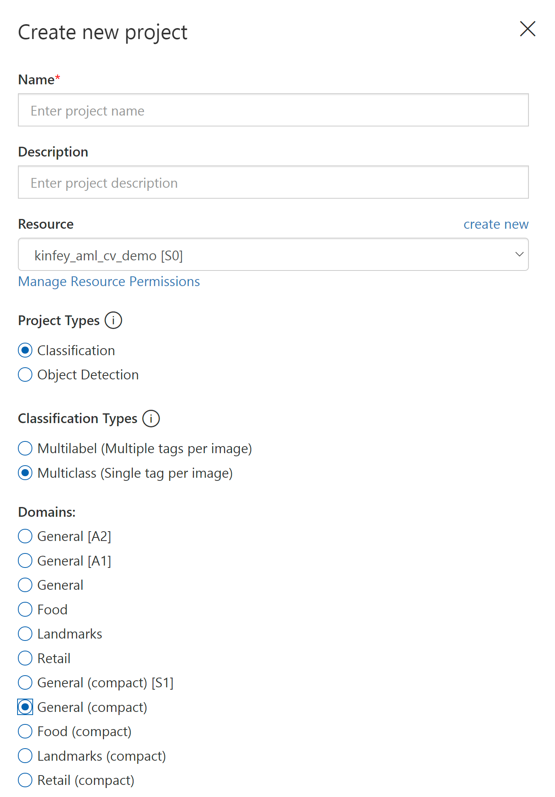
  

Custom Vision支持图像分类和实体识别，你可以根据自己的需要选择，这里选择图像分类(Classification)

选择识别多类型单标签(Single tag per image)

**建议选择General(compact),这个选项支持多种模型类型的导出，如TensorFlow, ONNX, CoreML等，适应部署到不同终端**
  

### 4.创建好后进入项目，并添加你需要分类的tag,这里针对bb8,c3po,r2d2三个标签(你可以通过项目的image标签上传对应图片),并针对标签上传基础图片数据#

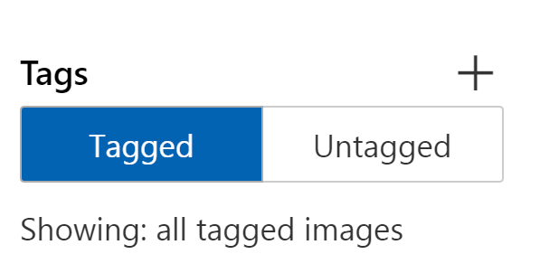  
  

### 5.上传好后，就可以按Train按钮进行训练即可,选择Quick Training

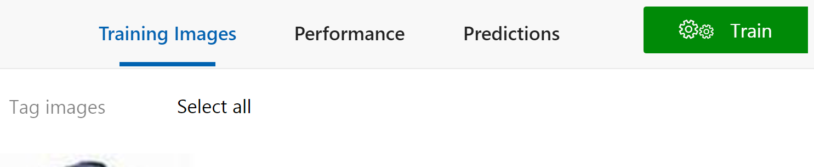  
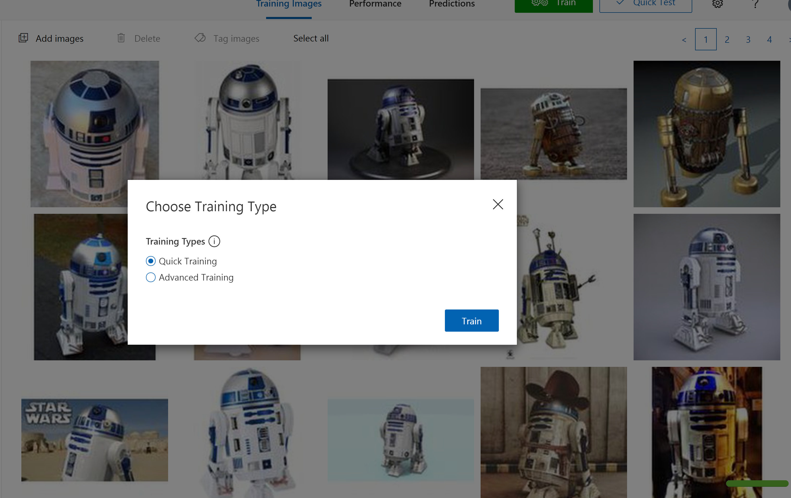  

###  6. 稍等片刻，你就可以完成相关的训练

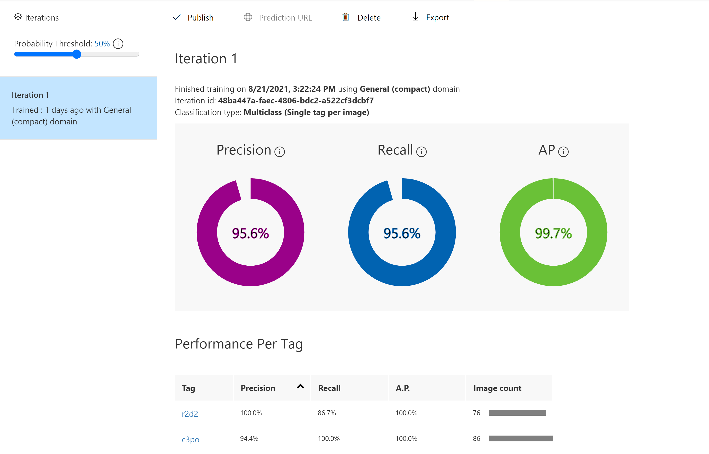  

### 7 .你可以通过Export方式导出你所需要的离线模型

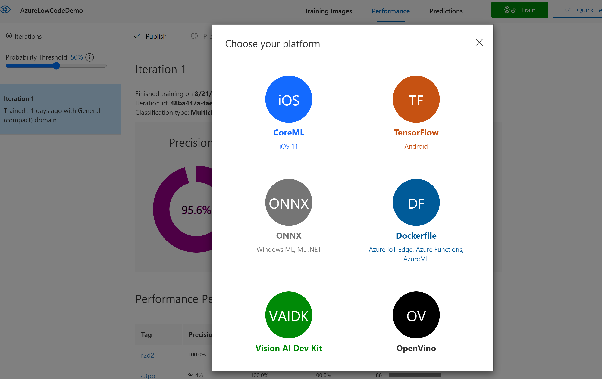  

### **8. 你可以通过Quick Test完成测试

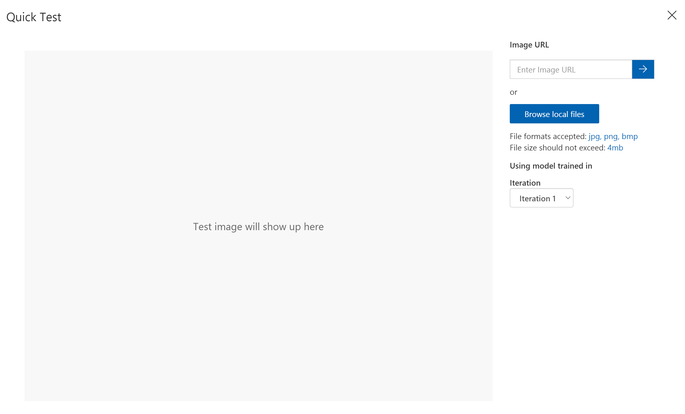  

<h1 style="color:Red">你现在一行代码都没有写过，哈哈做计算机视觉也不是很难</h1>