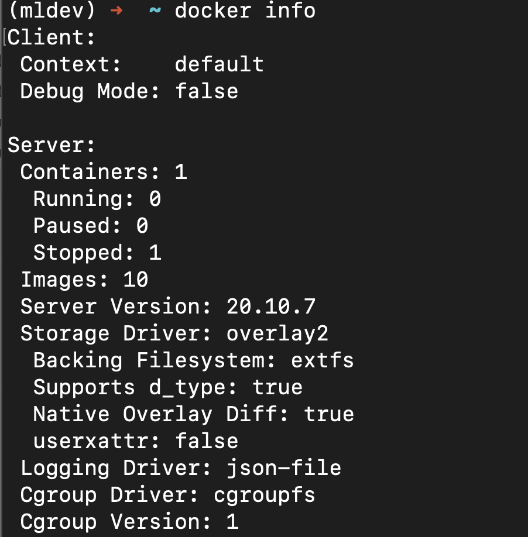
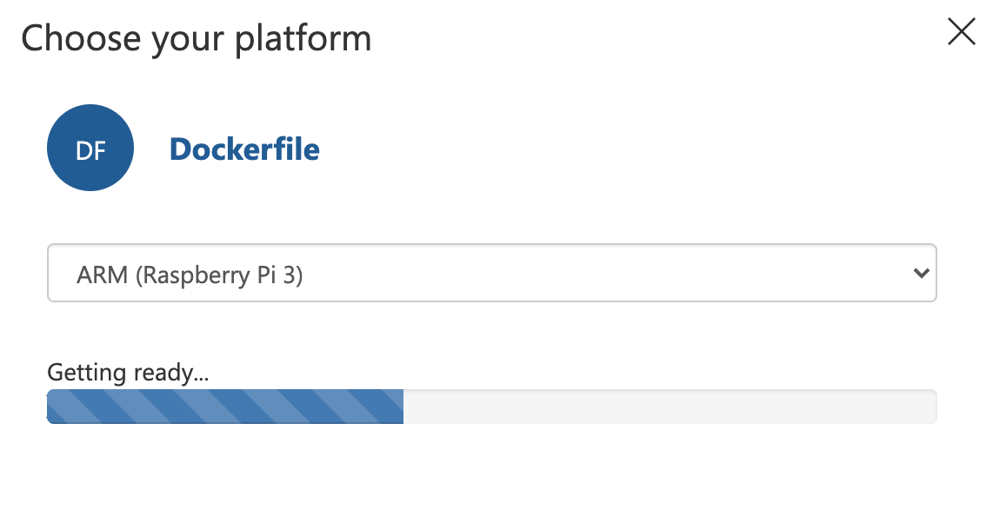
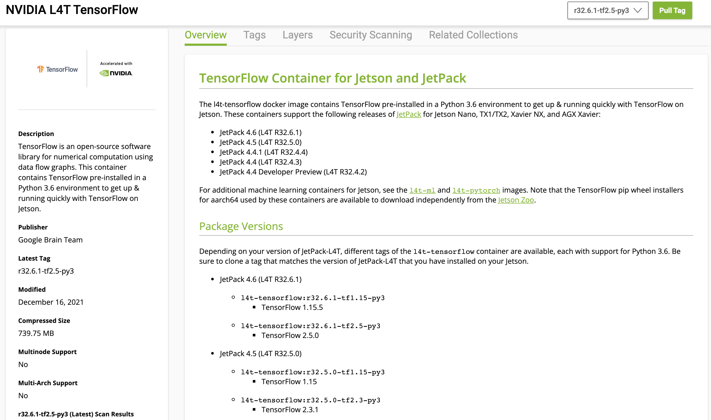
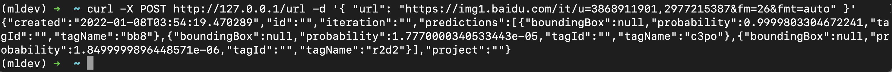

# **04. Custom Vision 的模型导出部署到 Jetson Nano 上**

## **1. 关于Jetson Nano本地的Docker 安装**

<br/>

```bash
sudo apt-get update -y
sudo apt-get upgrade -y
sudo apt-get install curl python3-pip libffi-dev python-openssl libssl-dev zlib1g-dev gcc g++ make -y
curl -sSL https://get.docker.com/ | sh
sudo pip3 install docker-compose
sudo docker-compose --version
```

<br/>

安装成功后，运行 docker info ，可以看到一下信息



<br/>
<br/>

## **2 .关于从Custom Vision 导出的模型**


<br/>

通过容器快出导出

但这里注意不能直接部署，因为这只是给到树莓派的容器

<br/><br/>


## **3 .关于Jetson Nano 里的TensorFlow 容器**

l4t-tensorflow docker 镜像包含预安装在 Python 3.6 环境中的 TensorFlow，以便在 Jetson 上使用 TensorFlow 快速启动和运行。 这些容器支持以下版本的 JetPack for Jetson Nano、TX1/TX2、Xavier NX 和 AGX Xavier：

JetPack 4.6 (L4T R32.6.1)
JetPack 4.5 (L4T R32.5.0)
JetPack 4.4.1 (L4T R32.4.4)
JetPack 4.4 (L4T R32.4.3)
JetPack 4.4 开发者预览版 (L4T R32.4.2)


<br/><br/>

更多相关的知识 <a href="https://catalog.ngc.nvidia.com/orgs/nvidia/containers/l4t-tensorflow">https://catalog.ngc.nvidia.com/orgs/nvidia/containers/l4t-tensorflow</a>

<br/><br/>


```bash


FROM nvcr.io/nvidia/l4t-tensorflow:r32.5.0-tf2.3-py3

RUN apt-get update -y
RUN apt-get install python3-pip -y
RUN pip3 install -U pip -i https://pypi.tuna.tsinghua.edu.cn/simple


RUN DEBIAN_FRONTEND=noninteractive apt-get install -y python3-opencv 

RUN pip3 install flask pillow   -i https://pypi.tuna.tsinghua.edu.cn/simple

COPY app /app
# Expose the port
EXPOSE 80
# Set the working directory
WORKDIR /app
# Run the flask server for the endpoints
CMD python3 -u app.py


```

<br/>
<br/><br/>

