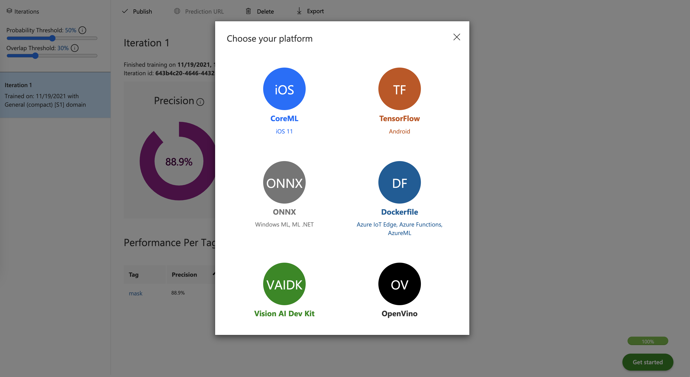
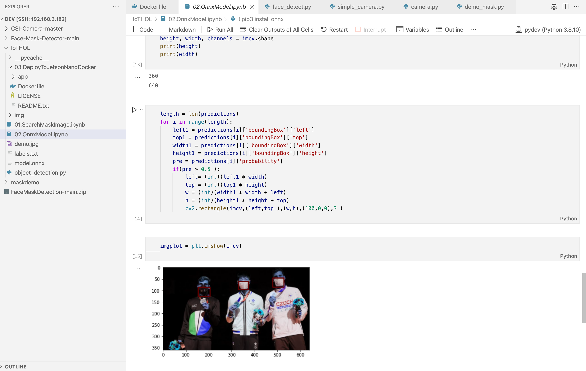
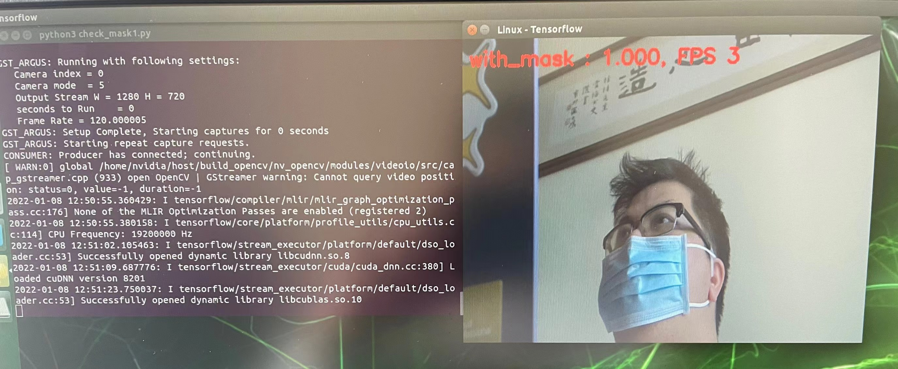
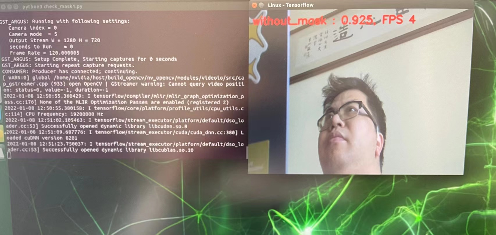

# **5. 实现口罩检测**

## **1. 通过Custom Vision 训练口罩实体检测** ##

<br/><br/>


<br/>
通过Object Dectection 完成相关训练，并导出TensorFlow 模型和ONNX模型


<br/><br/>


<br/><br/>

## **2. 在Jetson Nano 上部署模型**


<br/>

这里我建议通过远程端完成相关的操作
<br/>

**ONNX的Notebook**
<br/>
<br/>

<br/>
<br/>


**TF直接部署应用**

<br/>
<br/>

<br/>
<br/>

<br/>
<br/>

注意：Open CV 会有内存问题

```bash

export LD_PRELOAD=/usr/lib/aarch64-linux-gnu/libgomp.so.1

```


