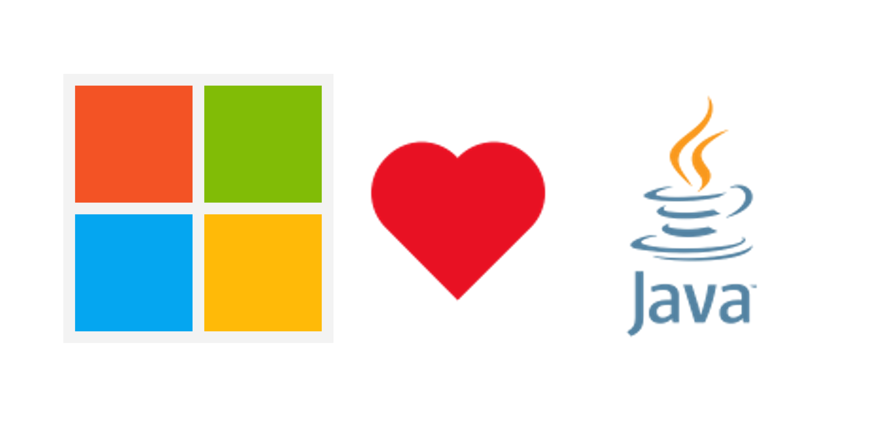
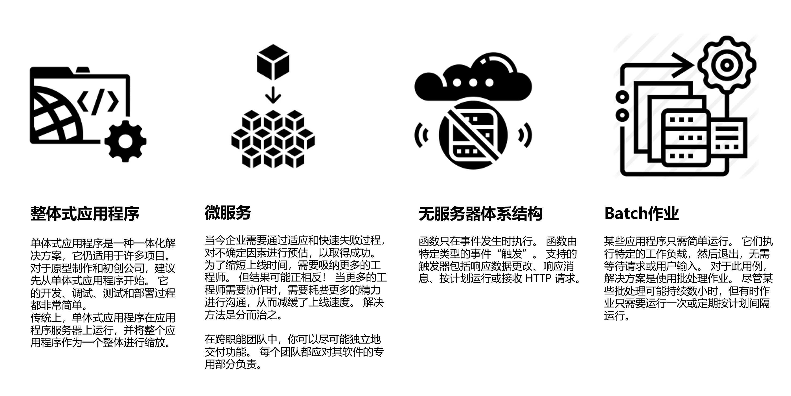
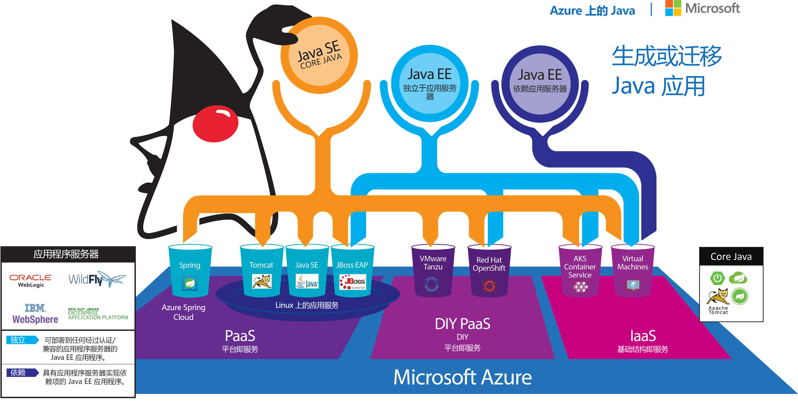

# **关于微软和Java的故事**

Java是企业内部最受欢迎的编程语言之一，全球有数以百万记的Java编程人员，在中国，Java还是不少互联网公司的选择。很多高校也以Java作为主要编程语言的教学。

云端时代来临，对于不少公有云厂商，都希望企业或者互联网公司迁移到公有云上，这个时候抓住Java的企业上云就是必不可少的。微软 Azure 公有云就把Java 企业的数字化转型看作是非常重要的战略，从简单的Web应用，到微服务的支持，再到Severless的支持都有非常大的支持。

微软的产品也有不少基于Java的解决方案，如 LinkedIn、Yammer、Minecraft 和 Surface Duo都在使用Java ,所以有非常强大的经验。通过Azure可以满足企业数字化转型的要求。

微软是OpenJDK的贡献者，更发布了Microsoft Open JDK(<a href="https://www.microsoft.com/openjdk">https://www.microsoft.com/openjdk</a>) Microsoft 致力于与 OpenJDK 的行业合作伙伴合作，以实现 Java 生态系统的共同利益。 我们的默认策略是在所有补丁被接受时将其上传。微软在2020年贡献WindowsOnARM 的Java集成，并为 macOS M1的Java集成的重要代码贡献。

在Azure上Java的支持是非常完整的，我们先来看看传统Java的应用场景

Azure上的Java

通过上述的支持，可以通过Azure上的虚拟机，容器，应用服务，以及Azure Spring Cloud完成相关的支持。

