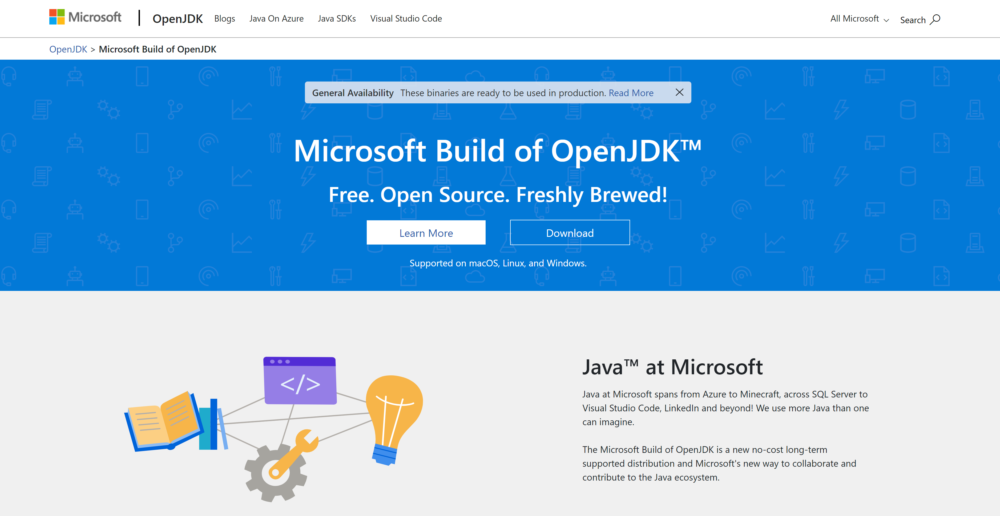
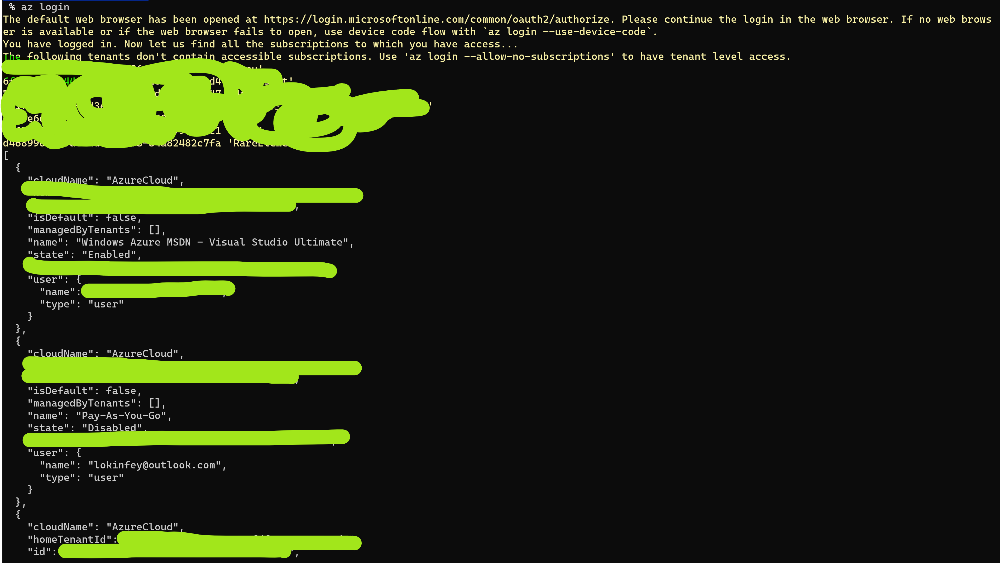
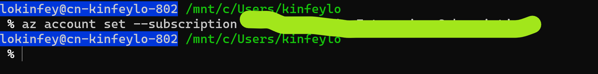

# **环境安装**

## **1. JDK 环境安装**

微软的OpenJDK 已经发布，你可以通过<a href="https://www.microsoft.com/openjdk">https://www.microsoft.com/openjdk</a>进行安装



这里要说明一下，现在微软版本的JDK有以下两个版本第一个版本是基于OpenJDK 11 ，第二个版本基于Open JDK 16 ,这里要说明一点，如果你是基于苹果Apple Silicon的设备请使用16的版本去安装。

具体安装请参考<a href="https://docs.microsoft.com/zh-cn/java/openjdk/install">https://docs.microsoft.com/zh-cn/java/openjdk/install</a>

注意：本次课程，你可以使用其他版本的OpenJDK来完成，微软的OpenJDK 只是建议

## **2. Azure 的环境**

关于Azure的环境申请，如果你没有Azure 的账号，建议使用信用卡去申请一个Azure的免费12个月使用账号，具体地址是<a href="https://azure.microsoft.com/zh-cn/free"/>https://azure.microsoft.com/zh-cn/free/</a>

如果你是一位学生或者教师你可以使用Azure的学生账号申请，当然你需要一个有edu后序的邮箱，具体地址是<a href="https://aka.ms/StudentGetAzure"/>https://aka.ms/StudentGetAzure</a>


## **3. Azure CLI的安装**

当你拥有Azure后，你需要在本地配置Azure CLI脚本，这里你需要通过命令行的方式完成Azure CLI的安装，具体方法是<a href="https://docs.microsoft.com/en-us/cli/azure/install-azure-cli"/>https://docs.microsoft.com/en-us/cli/azure/install-azure-cli</a>

安装完成后执行以下操作

```bash
az login
```

系统会跳转到浏览器，并让你选择Azure的登录账号，当选择好后，你就可以回到命令行




命令行会告诉你账号下的订阅信息，你可以根据自己需要选择订阅信息,如下


```bash
az account set --subscription "你选择的订阅名字"
```




## **4. Visual Studio Code 安装**

本次动手实现使用Visual Studio Code ，安装地址<a href="https://code.visualstudio.com/">https://code.visualstudio.com/</a>


