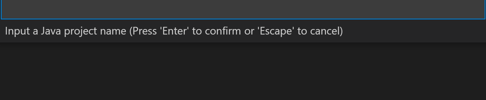

# **Visual Studio Code调试Java**

Visual Studio Code 不仅是跨平台的编辑器，更是支持多语言的开发(编码，调试，测试等)，可以说是微软爱开源很重要的一环。如果你是一名Java开发者，或者会对Eclipse, IntelliJ更为熟悉，但是Visual Studio Code 是你一个更好的选择。

要在Visual Studio Code 开发Java环境，你必须安装微软原生开发的插件，通过插件按钮搜索Extension Pack for Java。

<br/>

安装成功后，你就可以在Visual Studio Code中编写, 调试，测试，部署Java项目了 。

## **通过Visual Studio Code创建一个简单的Java程序**

1. 在任意位置创建一个holdemo的文件夹

```bash
mkdir holdemo
```

2. 用Visual Studio Code 打开该文件夹, 然后按Ctril+Shift+P(Windows/Linux)/Cmd+Shift+P，选择Java:Create Java Project

<br/>

选择No build tools

<br/>

然后选择当前holdemo文件夹

<br/>

再命名一个项目名字JavaVSCodeDemo按回车


<br/>

回车后就可以打开一个VSCode新的窗口，你可以看到一个全新的Java项目


<br/>

你应该可以看到这是一个非常标砖的Java项目，src里面是你项目中的代码，lib是你引用的包，vscode文件夹就是你的Visual Studio Code相关的配置文件，选择debug按钮，创建你的launch.json


<br/>

因为你是Java调试，所以选择Java, 这里你要注意，你可能会遇到以下问题

<br/>

这个时候你需要到vscode文件夹的settings.json去设置，

```json

{
    "java.project.sourcePaths": ["src"],
    "java.project.outputPath": "bin",
    "java.configuration.runtimes": [
        {
          "name": "JavaSE-1.11",
          "path": "你的java路径",
        },
      ]
}

```

然后你就可以Debug你的Java应用了


<br/>


