# **Visual Studio Code创建spring boot项目**

Java的框架有很多，我们接下来以主流的spring boot做例子，让大家直接通过Visual Studio Code完成spring boot项目的创建。

## **什么是Spring boot**

<br/>

spring boot 是所有基于 Spring 开发的项目的起点。spring boot 的设计是为了让你尽可能快的跑起来 Spring 应用程序并且尽可能减少你的配置文件。简单来说就是SpringBoot其实不是什么新的框架，它默认配置了很多框架的使用方式，就像maven整合了所有的jar包，spring boot整合了所有的框架（不知道这样比喻是否合适）。

结合之前的动手实验，我们可以通过Visual Studio Code创建Java项目，当然spring boot也不例外

打开你的Visual Studio Code ,打开之前创建的holdemo文件夹，然后按Ctrl+Shift+P(Windows/Linux) / Cmd+Shift+P创建项目，选择spring boot项目。


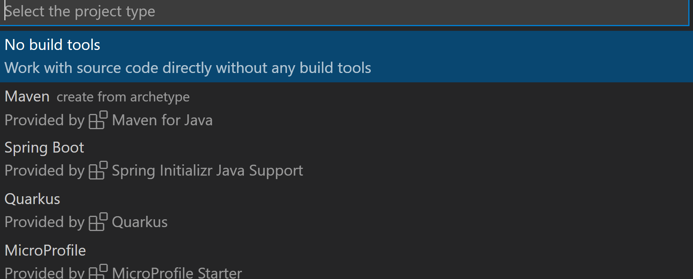<br/>

这个时候Visual Studio Code会提示你需要spring Boot的相关插件，请选择Install


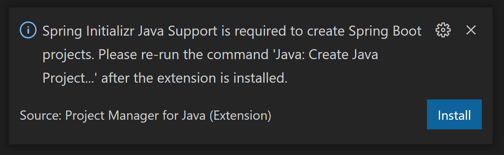<br/>


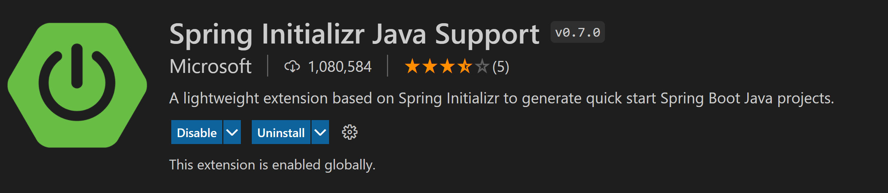<br/>


安装完后你就可以创建基于spring boot的应用了

他支持主流的Maven或者Gradle两种方式

为初学者介绍以下**Maven**和**Gradle**

**Maven**为Java引入了依赖管理系统。用groupId、artifactId、version组成的Coordination（坐标）唯一标识一个依赖。任何基于Maven构建的项目自身也必须定义这三项属性，生成的包可以是Jar包，也可以是war包或者ear包。

```xml
<dependency>
 <groupId>junit</groupId>
 <artifactId>junit</artifactId>
 <version>4.12</version>
 <scope>test</scope>
</dependency>
<dependency>
 <groupId>org.springframework</groupId>
 <artifactId>spring-test</artifactId>
</dependency>
```

**Gradle**在设计的时候基本沿用了Maven的这套依赖管理体系。不过它在引用依赖时还是进行了一些改进。首先引用依赖方面变得非常简洁。

```txt
dependencies {
 compile 'org.hibernate:hibernate-core:3.6.7.Final'
 testCompile ‘junit:junit:4.+'
}
```

究竟是Maven还是Gradle?这个就见仁见智了，我选择Maven作为本次的动手实验的环境。


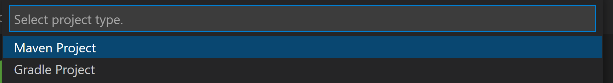<br/>

选择后你会选择spring boot的版本，这里用2.5.4


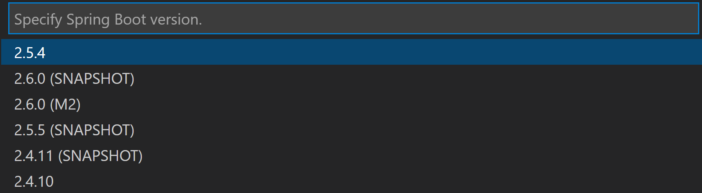<br/>

定义你要使用的语言，默认使用Java

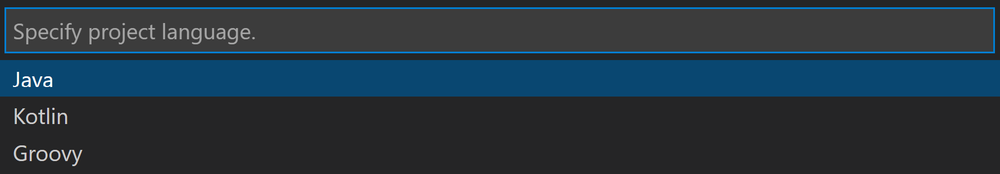<br/>

生成groupid , 使用com.javahol

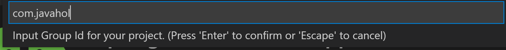<br/>

项目id 使用springbootdemo

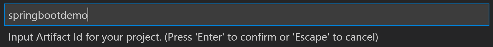<br/>

用jar作为打包方式

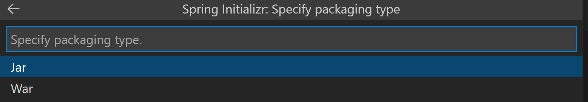<br/>

指定jdk版本，我使用11

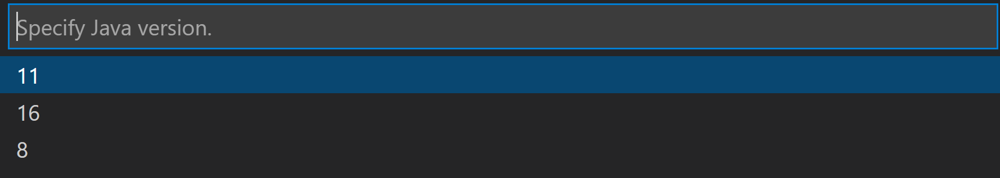<br/>

这个时候按回车你就创建完成了，在Visual Studio Code新窗口打开项目，


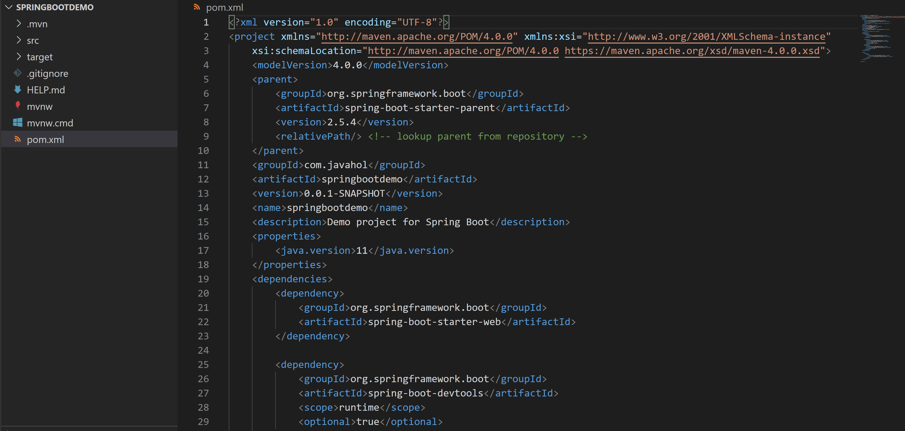<br/>

这个时候基本的Springboot项目就创建好了

通过Ctrl+Shift+P(Windows/Linux) / Cmd+Shift+P 添加一个新的Java类别,在src/main/java/com/javahol/springbootdemo保存为APIController.java 


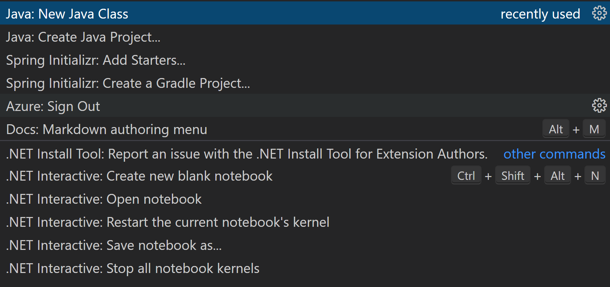<br/>

```java

package com.javahol.springbootdemo;

import org.springframework.web.bind.annotation.PathVariable;
import org.springframework.web.bind.annotation.RequestMapping;
import org.springframework.web.bind.annotation.RequestMethod;
import org.springframework.web.bind.annotation.RestController;

@RestController
@RequestMapping("api")
public class APIController {

    
    @RequestMapping(value = "/getInfo/{name}",method = RequestMethod.GET)
    public String getInfo(@PathVariable String name){
        return "Hi ," + name ;
    }


    
}

```

并在APIController.java的 return "Hi," + name 所在行设置断点

通过Debug运行应用，打开浏览器输入http://localhost:8080/api/getInfo/azure 

你就可以对Spring boot应用进行调试


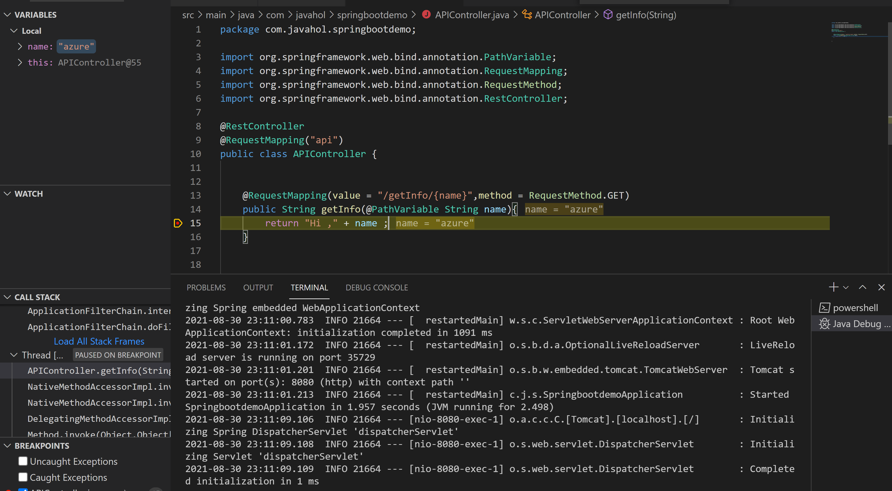<br/>

当然你也可以通过在Visual Studio Code 命令行方式完成相关打包错做

```bash
./mvnw package
````

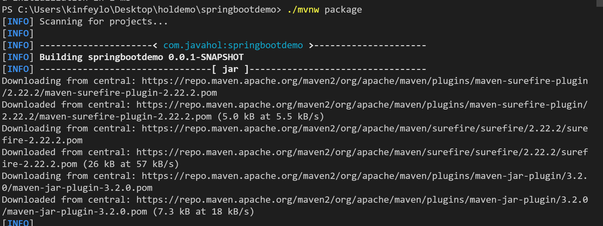<br/>

你可以直接运行jar包，在Visual Studio Code 输入如下命令

```bash
java -jar .\target\springbootdemo-0.0.1-SNAPSHOT.jar  
```

打开浏览器输入


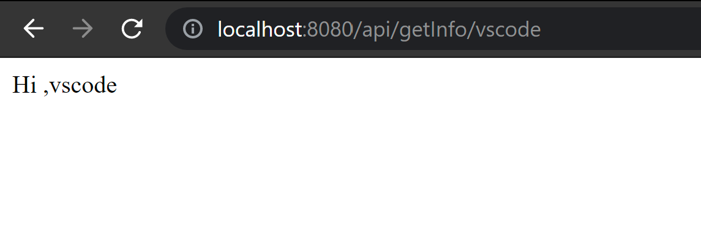<br/>


