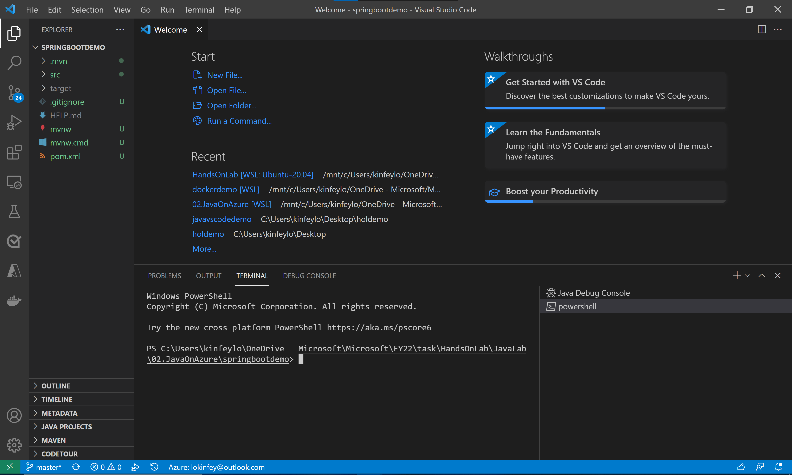
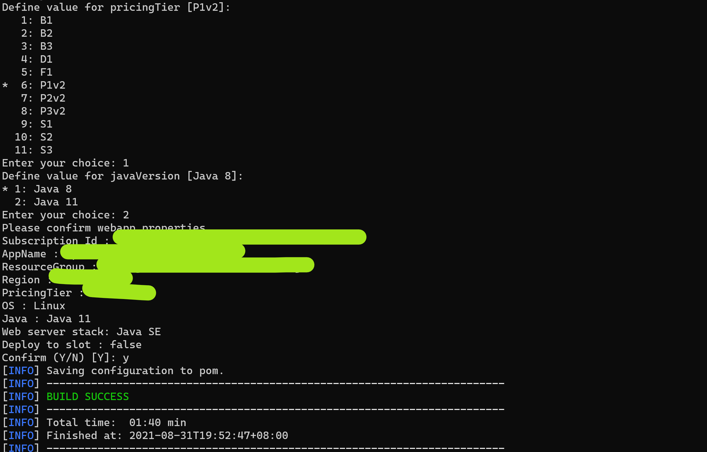
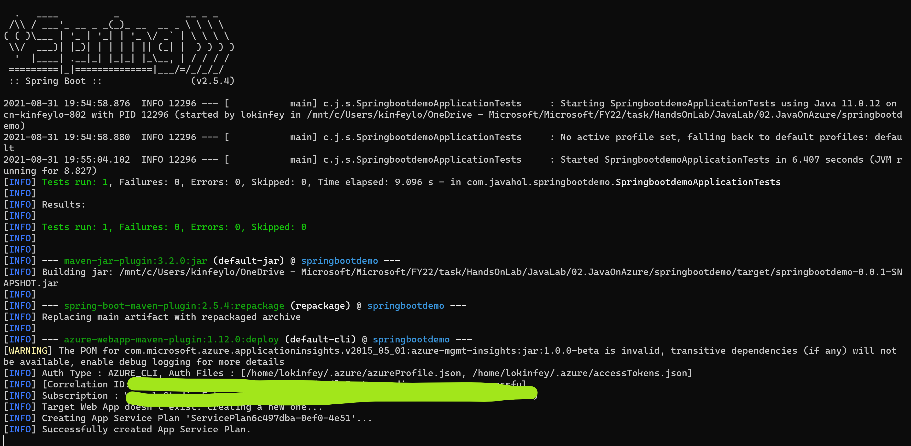
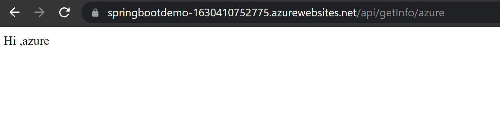

# **Spring boot应用部署到Azure**

   

Spring 支持快速部署到Azure,你可以用Azure App Service的方式或者Azure容器的方式以及Azure Spring Cloud 的方式快速部署应用。

注意：在部署前，还是建议安装好Azure CLI 你可以回到安装环境的步骤看看如何配置好Azure CLI 。

我们用户之前实验一创建的Spring boot应用程序，做一个最简单的App Service 部署。

1. 通过Visual Studio Code打开命令行，进入PowerShell 环境

  

2. 在命令行输入以下命令对你的应用进行打包

```bash
 .\mvnw package
```

打包成功后，通过运行jar包，检查是否打包成功

```bash
 .\mvnw package
```

3. 在本地安装mvn(<a href="https://maven.apache.org/download.cgi">https://maven.apache.org/download.cgi</a>)

4. 添加azure webpp 的引用

```bash
mvn com.microsoft.azure:azure-webapp-maven-plugin:1.12.0:config
```

做相应配置


  

5. 部署

```bash
mvn package com.microsoft.azure:azure-webapp-maven-plugin:1.12.0:deploy
```

  

稍等片刻


 


