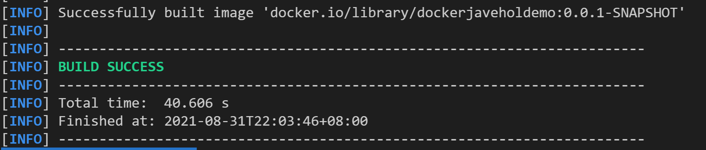
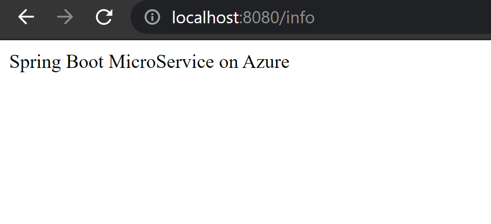
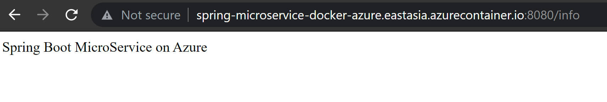

# **通过Azure 容器实例部署SpringBoot构建的微服务应用**


## **微服务**

微服务是一种现代软件方法，其中应用程序代码以小的、可管理的、独立于其他部分的方式交付。

## **为什么使用微服务**

它们的小规模和相对隔离可以带来许多额外的好处，例如更容易维护、提高生产力、更大的容错能力、更好的业务一致性等等。

## **使用Spring boot构建微服务**

使用 Spring Boot，您的微服务可以从小规模开始并快速迭代。 这就是它成为 Java 微服务事实上的标准的原因。 使用 Spring Initializr 快速启动您的项目，然后打包为 JAR。 使用 Spring Boot 的嵌入式服务器模型，您可以在几分钟内准备好。

## **什么是Azure 容器服务**

### **1. 无需管理服务器，即可运行容器**

通过在 Azure 容器实例 (ACI) 中运行工作负载，可专注于应用程序的设计和构建，而不是在管理运行应用程序的基础结构上。


### **2. 按需增强容器的灵敏性**

使用单个命令将容器部署到云端——速度和便捷性史无前例。必要时，可使用 ACI 为苛刻的工作负载预配额外计算。例如，借助 Virtual Kubelet，在流量出现峰值时使用 ACI 从 Azure Kubernetes 服务 (AKS) 群集弹性地突发。


### **3. 通过虚拟机监控程序隔离确保应用程序的安全**

获取适合你的容器工作负载的虚拟机安全性，同时保持轻量级容器的效率。ACI 利用虚拟机监控程序隔离每个容器组，确保容器不共享内核，独立运行。


**注: 你必须安装Azure CLI ，你可以参考安装手册**

**STEP 01**

参考之前实验在Visual Studio Code构建一个SpringBoot Web的项目, 项目名命名为dockerjaveholdemo

**STEP 02**

在代码添加

```java
@SpringBootApplication
@RestController
public class DockerjaveholdemoApplication {

	public static void main(String[] args) {
		SpringApplication.run(DockerjaveholdemoApplication.class, args);
	}

	
    @GetMapping("/info")
    public String info() {
        return "Spring Boot MicroService on Azure";
    }

}
```

**STEP 03**

在命令行通过MAVEN构建容器

```bash
mvn spring-boot:build-image
```

<br/>


**STEP 04**

继续运行以下命令


```bash
docker run -p 8080:8080 dockerjaveholdemo:0.0.1-SNAPSHOT 
```

你可以通过浏览器访问http://localhost:8080/info


<br/>

通过Ctrl+C停止容器运行

注意：如果你没有安装Docker，可以去<a href="https://docs.docker.com/get-docker/">https://docs.docker.com/get-docker/</a>


**STEP 05**

通过Azure CLI配置相关的Azure 资源

根据需要创建资源组和所在区域

```bash
az group create --name dockerJavaHOLDemoGroup --location eastasia
```

创建私有的容器并绑定到刚生成的资源组

```bash
az acr create --resource-group dockerJavaHOLDemoGroup --name javaHOLDockerDemo --sku Basic
```
登录进去私有容器

```bash
az acr login --name javaholdockerdemo  
```
标注本地容器和azure端对应的位置

```bash
docker tag dockerjaveholdemo:0.0.1-SNAPSHOT javaholdockerdemo.azurecr.io/dockerjaveholdemo:0.0.1-SNAPSHOT
```

推送本地容器到Azure


```bash
docker push javaholdockerdemo.azurecr.io/dockerjaveholdemo:0.0.1-SNAPSHOT  
```

验证以下是否存在

```bash
az acr repository list --name javaholdockerdemo --output table 
```

允许容器的admin权限

```bash
az acr update --name javaholdockerdemo --admin-enabled true
```
显示容器用户名和密码

```bash
az acr credential show --name javaholdockerdemo  
```

在azure上正式创建容器实例

```bash
az container create --resource-group dockerJavaHOLDemoGroup --name javadockerholcontainer --image javaholdockerdemo.azurecr.io/dockerjaveholdemo:0.0.1-SNAPSHOT --dns-name-label spring-microservice-docker-azure --ports 8080 
```

STEP 06 浏览器输入http://spring-microservice-docker-azure.eastasia.azurecontainer.io:8080/info


<br/>


