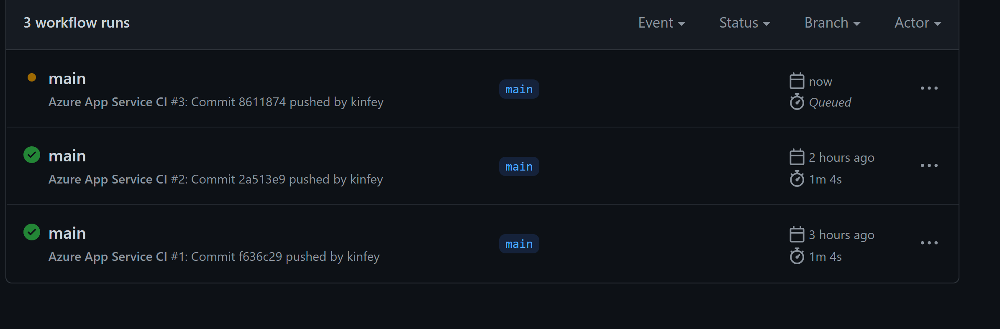
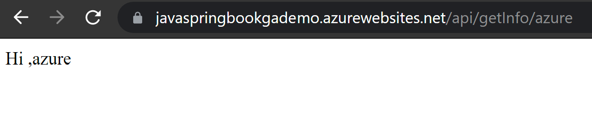

# **通过GitHub Action完成CI/CD 并同步更新Azure Web App Service**

**你有使用Github吗？你知道GitHub Action吗？**

在 GitHub Actions 的仓库中自动化、自定义和执行软件开发工作流程。 您可以发现、创建和共享操作以执行您喜欢的任何作业（包括 CI/CD），并将操作合并到完全自定义的工作流程中。


GitHub Actions 支持自动化的软件开发生命周期工作流。 通过GitHub Actions，可以在Repository中创建工作流来生成、测试、打包、发布并部署到 Azure。当然支持Spring Boot的部署。

1. 创建你的Spring Boot 应用(建议你用Visual Studio Code直接创建，你可以通过之前的实验去学习)

2. 去Github 创建一个repository并把你的Spring Boot应用同步到Main的Branch上

3. 打开你的Azure 门户，创建一个Web App Service


<br/><br/>
<br/><br/>

注意: 选择Java 应用，因为我们的应用是针对Spring Boot,这里建议用JDK 11 ,并选择Linux的部署方式

4. 创建好后，跳转去创建Web App的位置


<br/><br/>

选择 Get publish.profile,下载配置文件

5. 去到你的Github的项目的设置位置，选择Secrets


<br/><br/>

添加新的Secret

<br/><br/>

把刚才下载的publish.profile 复制黏贴到Value里面，并把它的Name 设置为AZURE_WEBAPP_PUBLISH_PROFILE  

<br/><br/>

6. 在你的Spring boot项目根目录下添加文件夹.github ， 之后在该目录下再创建文件夹workflows，然后进入.github/workflows下创建deploy.yml ，添加以下内容

```json
name: Azure App Service CI

on:
  push:
    branches:
      - main //有些文档是master，但github更新后统一是main

jobs:
  build:
    runs-on: ubuntu-latest
    steps:
      - uses: actions/checkout@v2
      - name: Set up JDK 11
        uses: actions/setup-java@v1
        with:
          java-version: 11
      - name: Build with Maven
        run: mvn clean package
      - uses: azure/webapps-deploy@v2
        with:
          app-name: 你azure portal下设置的名字
          publish-profile: ${{ secrets.AZURE_WEBAPP_PUBLISH_PROFILE }} 
          package: '${{ github.workspace }}/target/*.jar'
```

然后保存，并同步到Github上

7.  点解Github对应项目上的Actions按钮

<br/><br/>

你就可以看到一些触发时间，你的CI/CD 就可以通过GithubAction 完成了


<br/><br/>

8. 你可以添加以下代码进行测试在你的springboot下src/main/java/com/javahol/githubactiondemo下添加APIController.java

```java
package com.javahol.githubactiondemo;

import org.springframework.web.bind.annotation.PathVariable;
import org.springframework.web.bind.annotation.RequestMapping;
import org.springframework.web.bind.annotation.RequestMethod;
import org.springframework.web.bind.annotation.RestController;

@RestController
@RequestMapping("api")
public class APIController {

    
    @RequestMapping(value = "/getInfo/{name}",method = RequestMethod.GET)
    public String getInfo(@PathVariable String name){
        return "Hi ," + name ;
    }


    
}
```

然后同步Pull到Github，去到项目Action你可以看到相关的操作


<br/><br/>

更新好后，你可以访问你设定的地址/api/getInfo/azure


<br/><br/>


