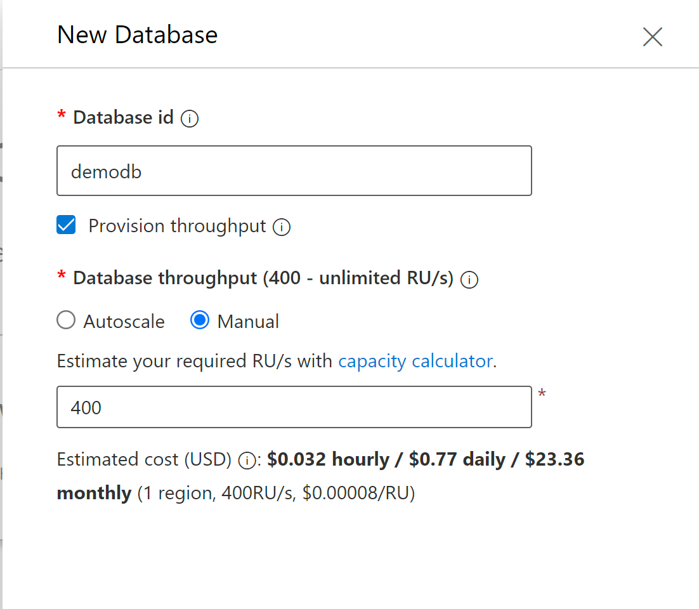

# **通过Azure Spring Cloud 创建应用**

## **什么是Azure Spring Cloud?**

<br/>

<a href="https://azure.microsoft.com/zh-cn/services/spring-cloud/">https://azure.microsoft.com/zh-cn/services/spring-cloud/</a><br/>

借助 Azure Spring Cloud，可以轻松地将 Spring Boot 微服务应用程序部署到 Azure，不需更改任何代码。 该服务管理 Spring Cloud 应用程序的基础结构，因此开发人员可以专注于其代码。 Azure Spring Cloud 可以通过以下方法提供生命周期管理：综合性监视和诊断、配置管理、服务发现、CI/CD 集成、蓝绿部署等。

<br/><br/>
<br/>

## **为什么使用Azure Spring Cloud**

<br/>

将应用程序部署到 Azure Spring Cloud 有很多好处。 方法：

有效地迁移现有 Spring 应用并管理云缩放和成本。
使用 Spring Cloud 模式实现应用现代化，以提高敏捷性和交付速度。
以云规模运行 Java，并在不使用复杂基础结构的情况下提高利用率。
无需依赖容器化即可快速开发和部署。
有效轻松地监视生产工作负载。
Azure Spring Cloud 同时支持 Java Spring Boot 和 ASP.NET Core Steeltoe 应用。 Steeltoe 支持目前以公共预览版的形式提供。 使用公共预览版产品/服务，你可以在产品/服务正式发布之前体验新功能。


<br/><br/>

<br/><br/>

Azure Spring Cloud 是 Azure 生态系统的一部分，用户可以通过它轻松绑定到其他 Azure 服务，其中包括存储、数据库、监视等。

Azure Spring Cloud 是适用于 Spring Boot 应用的完全托管服务，可让你专注于构建和运行应用，而无需管理基础结构。

只需为 Spring Boot 应用部署 JAR 或代码，或为 Steeltoe 应用部署 Zip，Azure Spring Cloud 就会自动将应用与 Spring 服务运行时和内置的应用生命周期关联起来。

监视也很简单。 部署后，可以监视应用性能，修复错误以及快速改进应用程序。

与 Azure 的生态系统和服务的完全集成。

Azure Spring Cloud 具有完全托管的基础结构和内置的生命周期管理且易于监视，可供企业使用。


<br/>

## **Azure CosmosDB**
<br/>
<a href="https://azure.microsoft.com/zh-cn/services/cosmos-db/">https://azure.microsoft.com/zh-cn/services/cosmos-db/</a><br/>
<br/>

Azure Cosmos DB 是一种用于新式应用开发的完全托管的 NoSQL 数据库。 个位数的毫秒响应时间以及自动和即时的可伸缩性，可保证任何规模的速度。 SLA 支持的可用性和企业级安全性可确保业务连续性。 得益于全球各地的统包多区域数据分布、适用于常用语言的开源 API 和 SDK，应用的开发速度更快、效率更高。 作为一项完全托管的服务，Azure Cosmos DB 使用自动管理、更新和修补，使你无需进行数据库管理。 它还通过经济高效的无服务器和自动缩放选项处理容量管理，这些选项可响应应用程序的需求，使容量与需求相匹配。
<br/>
<br/><br/>
<br/>

主要优势
保证任何规模的速度
获得无与伦比的 SLA 支持的速度和吞吐量、快速的全局访问和即时弹性。

SLA 对具有快速读写延迟的全局实时访问以及吞吐量和一致性提供支持
只需单击按钮，即可将多区域写入和数据分发到任何 Azure 区域。
在任何 Azure 区域独立且弹性地缩放存储和吞吐量（即使在不可预知的流量激增期间），以实现在全球范围内无限缩放。
简化应用程序开发
使用开源 API、多个 SDK、无架构数据和对操作数据的无 ETL 分析进行快速构建。

与新式（云原生）应用开发中使用的关键 Azure 服务深度集成，包括 Azure Functions、IoT 中心、AKS (Azure Kubernetes Service)、应用服务等。
从多个数据库 API 中进行选择，包括本机 Core (SQL) API、适用于 MongoDB 的 API、Cassandra API、Gremlin API 和表 API。
使用所选语言和适用于 .NET、Java、Node.js 和 Python 的 SDK，在 Core (SQL) API 上构建应用。 或者为任何其他数据库 API 选择的驱动程序。
使用 Azure Synapse Analytics 对 Azure Cosmos DB 中存储的近乎实时的操作数据运行无 ETL 分析。
通过更改源，可以轻松地跟踪和管理对数据库容器所做的更改以及使用 Azure Functions 创建触发事件。
Azure Cosmos DB 的无架构服务会自动为所有数据（无论数据模型为何）编制索引，从而快速交付查询。
关键任务就绪
保证每个应用程序的业务连续性、99.999% 的可用性和企业级安全性。

Azure Cosmos DB 提供了全面的 SLA 套件，包括全球业界领先的可用性。
通过自动数据复制轻松地将数据分布到任何 Azure 区域。 使用强一致性时，多区域写入或 RPO 0 无需停机。
通过自行管理的密钥体验企业级静态加密。
Azure 基于角色的访问控制可确保数据安全，并提供精细的控制。
完全托管和经济高效
端到端数据库管理，具有与应用程序和 TCO 需求相匹配的无服务器和自动缩放功能

完全托管的数据库服务。 自动、无需触控、维护、修补和更新，从而为开发人员了节省时间和资金。
适用于任何规模的不可预测或偶发性工作负载的经济高效选项，使开发人员无需计划或管理容量即可轻松入门。
无服务器模型提供尖峰工作负载自动响应服务，可按需管理流量激增。
自动缩放预配的吞吐量，可在保持 SLA 的同时自动并立即缩放容量以应对不可预测的工作负载。

<br/><br>


## **实例: Spring Boot 访问CosmosDB 并部署到SpringCloud的实例**

<br/><br/>


### **1. 通过命令行创建一个新的资源组，根据你的需要命名**

```bash

az group create -n 自己命名组名 -l eastasia

```

### **2. 通过命令行创建你的cosmosdb** 

```bash

az cosmosdb create -n cosmosdb名字 -g 第一步命名的组名 --locations regionName=eastasia

```


### **3. 创建成功后，可以通过创建的CosmosDB，去Data Explorer创建新的数据库**

<br/><br/>

如我创建一个命名为demodb的数据库

<br/><br/>

创建成功后如下

<br/><br/>

### **4. 通过命令行创建Azure Spring Cloud 服务**

通过Azue cli 添加Spring Cloud 的脚本支持

```bash

az extension add -n spring-cloud

```

为你的Azure ,创建Spring Cloud 服务

```bash

az spring-cloud create -n 你所创建的Spring Cloud名 -g 之前创建的组名 -l eastasia

```

### **5. 创建完成后你就可以为你的Azure Spring Cloud环境添加应用了**


```bash

az spring-cloud app create -n 你的应用名 -s 你之前创建的Spring Cloud名 -g 你之前的组

```

创建成功后为你的应用发布公共的权限


```bash

az spring-cloud update create -n 你的应用名 -s 你之前创建的Spring Cloud名 -g 你之前的组 --is-public true

```

### **6. 创建成功后，你就可以通过Azure Portal 查找到相关应用**


<br/><br/>

<br/><br/>

你可以通过浏览器访问URL

<br/><br/>

### **7. 选择你的Spring Cloud应用，然后通过Service Binding绑定刚创建的cosmosDB**


<br/><br/>

### **8.通过Visual Studio Code 快速创建一个基于Maven的Spring Boot项目(Spring Web, Azure Support, lombok)**

<br/><br/>

### **9. 创建好后添加类Info.java , InfoRepository.java , InfoController.java**

Info.java
```java

package com.javahol.springcloudapp;

import com.azure.spring.data.cosmos.core.mapping.Container;

import org.springframework.data.annotation.Id;

import lombok.AllArgsConstructor;
import lombok.Data;

@Data
@AllArgsConstructor

@Container(containerName = "Info")
public class Info {
    @Id
    public String id;
    public String location;
    
}


```

InfoRepository.java
```java

package com.javahol.springcloudapp;


import com.azure.spring.data.cosmos.repository.ReactiveCosmosRepository;

public interface InfoRepository extends ReactiveCosmosRepository<Info,String> {
    
}


```

InfoController.java

```java


import java.util.List;

import org.springframework.http.HttpStatus;
import org.springframework.http.ResponseEntity;
import org.springframework.web.bind.annotation.GetMapping;
import org.springframework.web.bind.annotation.PostMapping;
import org.springframework.web.bind.annotation.RequestBody;
import org.springframework.web.bind.annotation.RestController;


import reactor.core.publisher.Flux;
import reactor.core.publisher.Mono;


@RestController
public class InfoController {

    
    private InfoRepository infoRepository;

    public InfoController(InfoRepository repository) {
        this.infoRepository = repository;
    }

    @PostMapping("/info")
    public ResponseEntity<String> updateInfo(@RequestBody Info info) {
        Mono<Info> saveUserMono = infoRepository.save(info);
        saveUserMono.block();
        return new ResponseEntity<>("Successfully insert", HttpStatus.OK);
    }

    @GetMapping("/info")
    public ResponseEntity<List<Info>> getAllInfo() {
       Flux<Info> infoList= infoRepository.findAll();
        return new ResponseEntity<>(infoList.collectList().block(), HttpStatus.OK);
    }
    
}

```

### **10. 在pom.xml添加azure-cosmosdb-spring-boot-starter支持**

<br/>
```xml

<dependency>
	<groupId>com.azure.spring</groupId>
	<artifactId>azure-spring-boot-starter-cosmos</artifactId>
	<version>3.5.0</version> 
</dependency>

```

### **11. src/main/application.properties下把CosmosDB的链接串，密钥，以及对应数据库绑定**
<br/>

通过去Azure门户获取刚创建的CosmosDB信息
<br/>
azure.cosmos.uri=

通过去Azure门户获取刚创建的CosmosDB信息
<br/>
azure.cosmos.key=

通过去Azure门户获取刚创建的CosmosDB信息
<br/>
azure.cosmos.database=
<br/>
azure.cosmos.populateQueryMetrics=true

<br/>


### **12. 在Visual Studio Code运行**

<br/>
<font style="color:red">大家习惯用Postman获取REST信息，在Visual Studio Code下有Thunder Client建议先安装</font>

<br/><br/>

然后你可以通过运行应用，并打开Thunder Client


 <br/><br/>


 <br/><br/>

你也可以在CosmosDB 的Data Explorer上检查数据


<br/><br/> 


### **13. 打包推送到Spring Cloud**
<br/>

命令行输入

```bash

./mvnw package

```
```bash

az spring-cloud app deploy -n 你的应用名 -s 你之前创建的Spring Cloud名 -g 你之前的组 --jar-path 你打包后jar包的路径

```

稍等片刻部署就完成，同样用Thunder Clent查看以下


 <br/><br/>


 <br/><br/>


