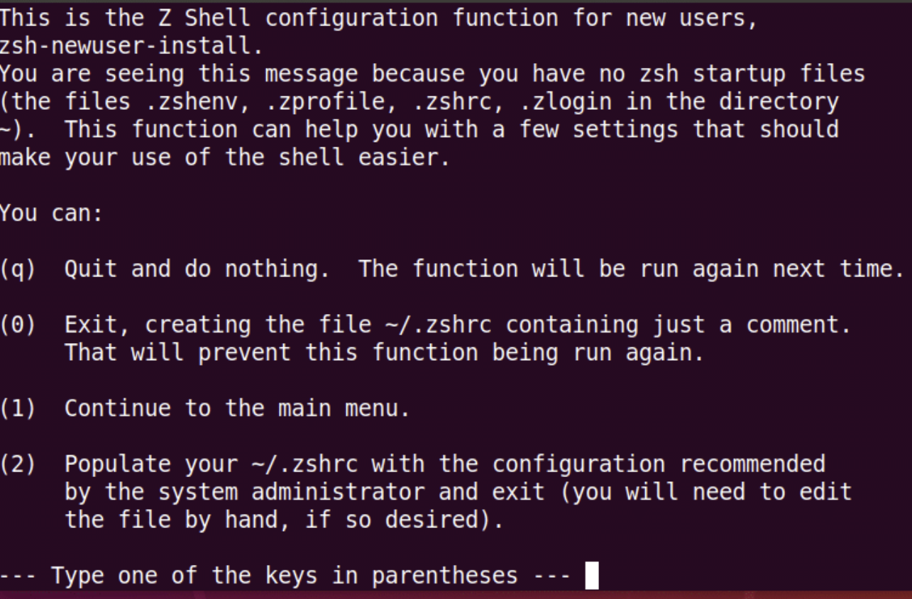
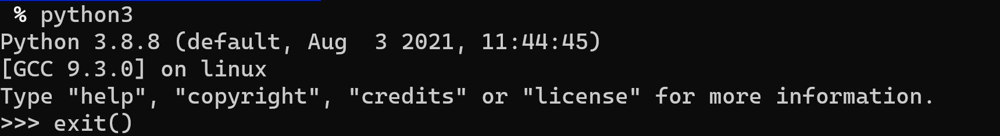

# **这是Linux/WSL2/macOS安装环境的一些步骤（基于pyenv和zsh）** #

## **1. 安装zsh** ##

### **Linux/WSL2下安装zsh** ###

```zsh

sudo apt update
sudo apt-get install zsh
sudo usermod -s /usr/bin/zsh $(whoami)
sudo reboot

```

**<div style="color:red">重启后会出现一下界面</div>**



**请选择2**


### **macOS下安装zsh** ###

**在macOS 10.13后都已经内置了zsh**


## **1. Linux/WSL2 通过pyenv安装Python** ##

```zsh

git clone https://github.com/pyenv/pyenv.git ~/.pyenv
 
echo 'export PYENV_ROOT="$HOME/.pyenv"' >> ~/.zprofile
       
echo 'export PATH="$PYENV_ROOT/bin:$PATH"' >> ~/.zprofile
       
echo 'eval "$(pyenv init --path)"' >> ~/.zprofile
       
exec $SHELL
       
git clone https://github.com/pyenv/pyenv-virtualenv.git $(pyenv root)/plugins/pyenv-virtualenv
       
echo 'eval "$(pyenv virtualenv-init -)"' >> ~/.zprofile
       
exec $SHELL
       
sudo apt-get install -y make build-essential libssl-dev zlib1g-dev libbz2-dev libreadline-dev libsqlite3-dev wget curl llvm libncurses5-dev xz-utils tk-dev libxml2-dev libxmlsec1-dev libffi-dev liblzma-dev
       
CONFIGURE_OPTS=--enable-shared pyenv install 3.8.8
       
pyenv virtualenv 3.8.8 pydev

```


## **2. macOS 通过pyenv安装Python** ##


```zsh
brew update
brew install pyenv

echo 'eval "$(pyenv init --path)"' >> ~/.zprofile
      
CONFIGURE_OPTS=--enable-shared pyenv install 3.8.8
       
pyenv virtualenv 3.8.8 pydev
```


**<div style="color:red">关于macOS 下brew 的安装请参考(https://brew.sh/)</div>**


### **安装成功验证如下** ###

