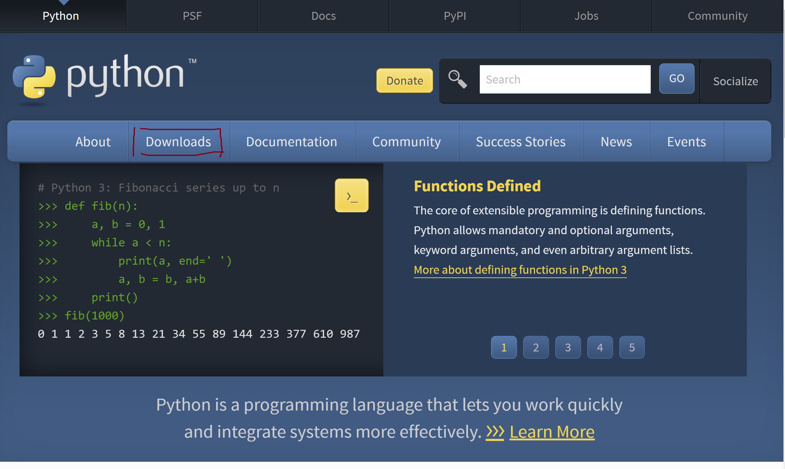
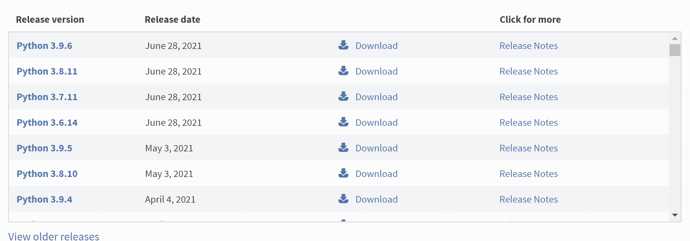
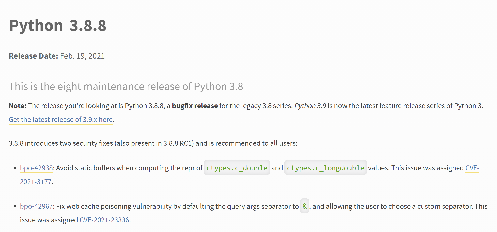
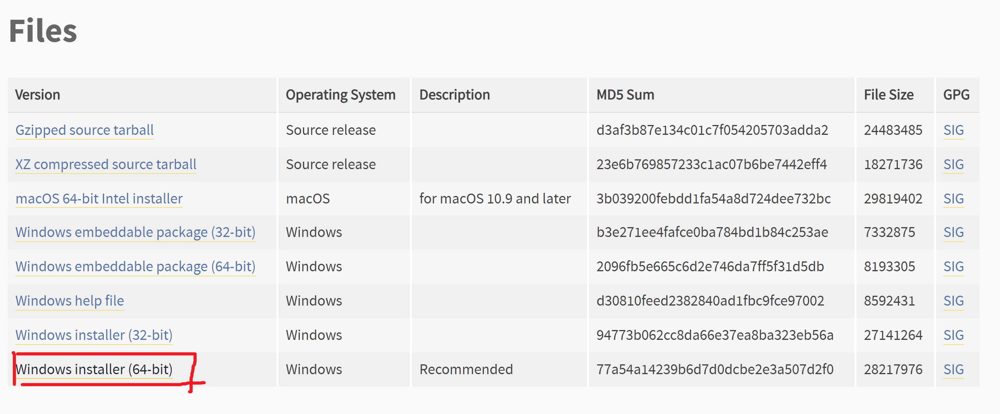
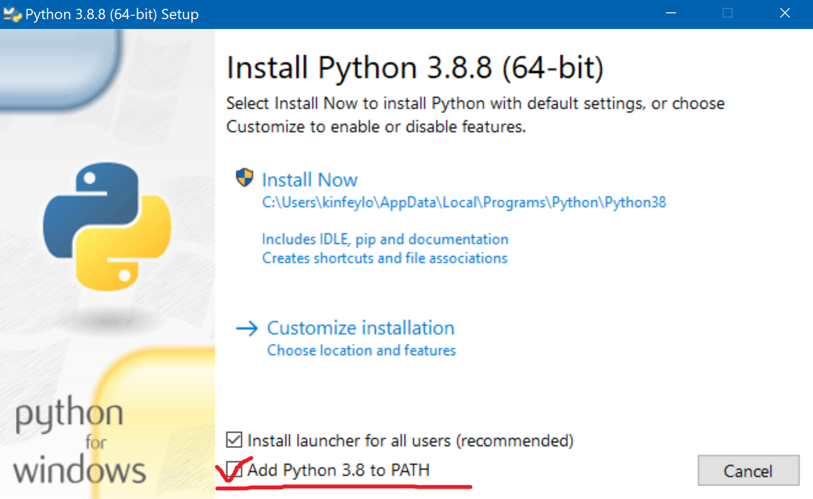
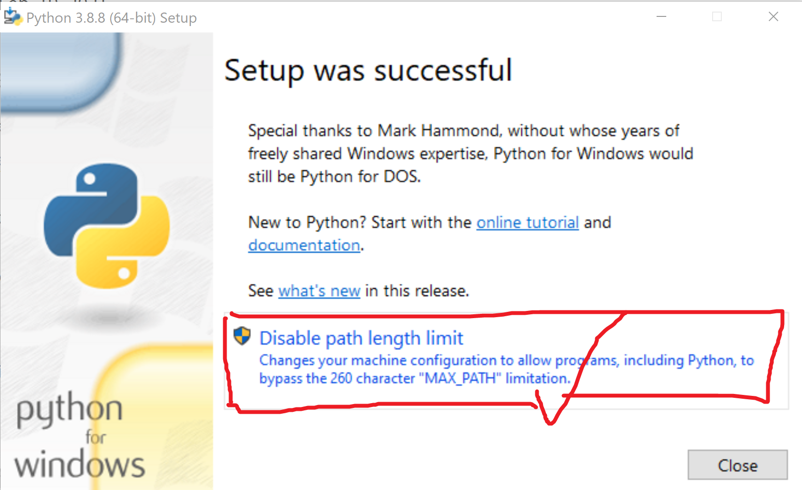
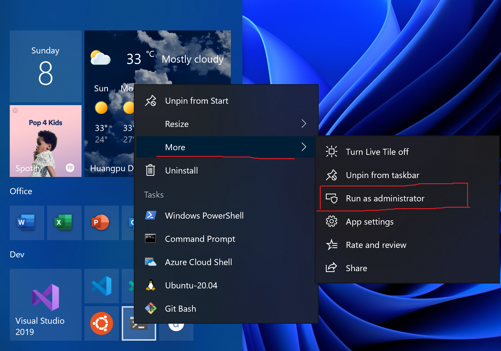
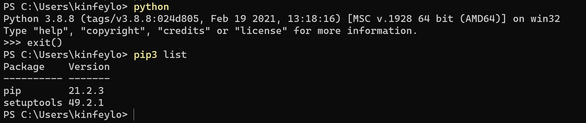

# **这是Windows安装环境的一些步骤** #

## **Python环境安装** ##

 

**1. 去Python官网(<http://python.org/)下载Python>**

 

**2. 点击下载Download ，选择3.8.x安装(建议选择3.8.8)**

 

 

**3. 下载选择64位的Python 3.8.8**

 

**4. 关于安装的一些细节**

**别忘记添加全局变量**

 

**还有取消长度限制**

 

**4. 关于安装的一些细节**

**请使用Windows Terminal , 如果没有安装，请去Windows Store安装**

**安装好Windows Terminal 后，通过administrator打开**

 

**测试环境**

 

