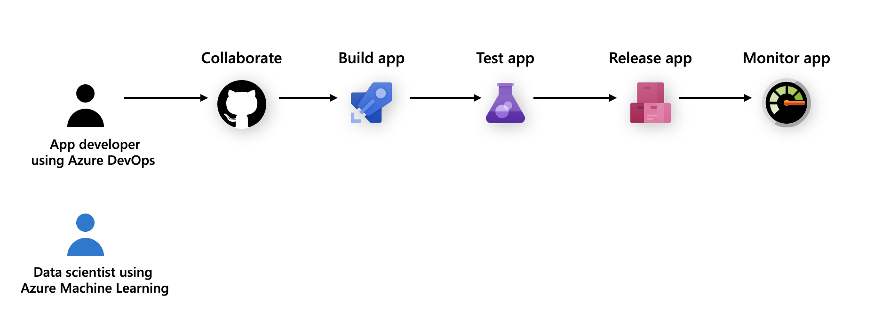
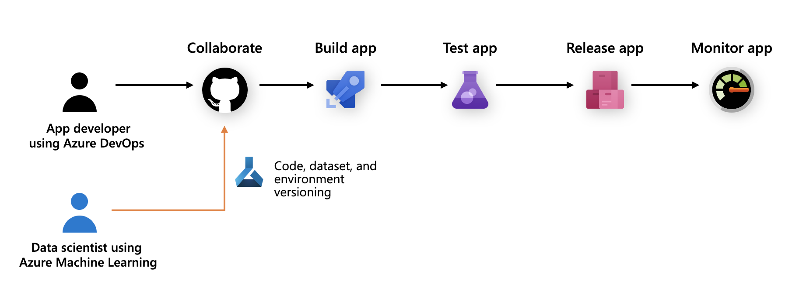
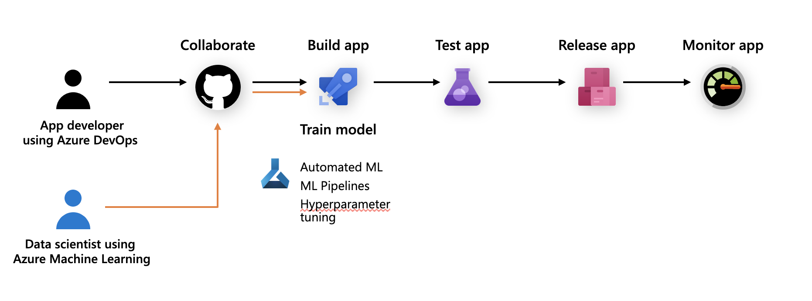
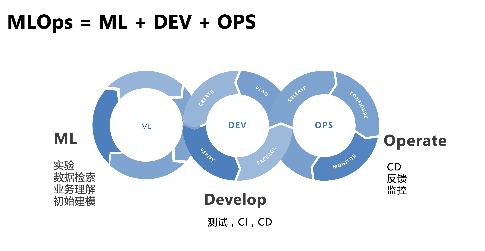
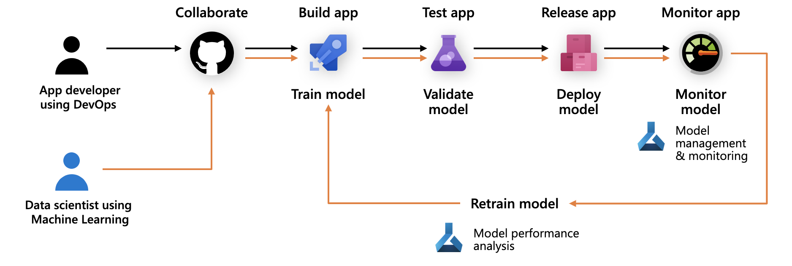

# **MLOps介绍**

## **什么是 MLOps？**

MLOps 是一种操作方法，旨在促进将实验性机器学习模型投入生产并有效维护它的过程。 MLOps 专注于将软件行业中使用的 DevOps 方法引入机器学习模型生命周期。 通过这种方式，我们可以定义 MLOPs 项目的一些主要特征：

### **1. 数据和模型版本控制**
### **2. 管道和流程的自动化**
### **3. 用于机器学习的 CI/CD**
### **4. 模型的持续监控**
 

 

## **数据和模型版本控制**

在机器学习项目中，数据科学家不断致力于开发新模型。 这个过程需要尝试不同的数据、参数和算法组合。 一个可以新旧实验中来回进行的环境是非常重要的，可以做有效比对。

 

 

## **在机器学习中的自动化**

能够快速部署，稳定工作流程(触发训练，部署，以及运行等工作), 快速运行

 

 

## **用于机器学习的 CI/CD**

就像在 DevOps 中一样，CI/CD 是一种通过自动化开发阶段来更频繁地进行更改的方法。 在机器学习 (ML) 中，此阶段与软件开发不同，模型不仅取决于代码，还取决于数据和超参数，并且将模型部署到生产中也更加复杂。

 

 

### **持续集成 (CI)**

ML 中的持续集成意味着每次更新代码或数据时，ML 管道都会重新运行，这是以所有内容都是版本化和可重现的方式完成的，因此可以跨项目和团队共享代码库。每次重新运行都可能包括培训、测试或生成新报告，从而更容易在生产中的其他版本之间进行比较。

 

### **持续部署 (CD)**

持续部署是一种将新版本自动部署到生产环境或任何环境（如登台）的方法。这种做法更容易接收用户的反馈，因为变化更快、更稳定，以及用于再训练或新模型的新数据。

 

## **持续监控**

 

与传统代码相比，机器学习模型是独特的软件实体，由于部署后输入模型的数据发生变化，它们的性能会随着时间的推移而波动。 因此，一旦部署了模型，就需要对其进行监控以确保其按预期执行。

 

