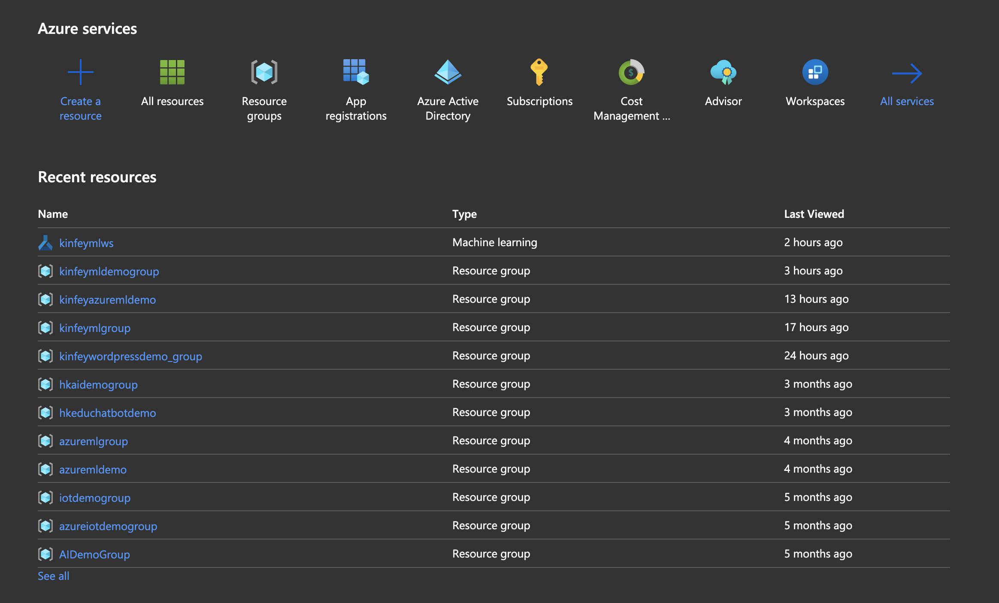
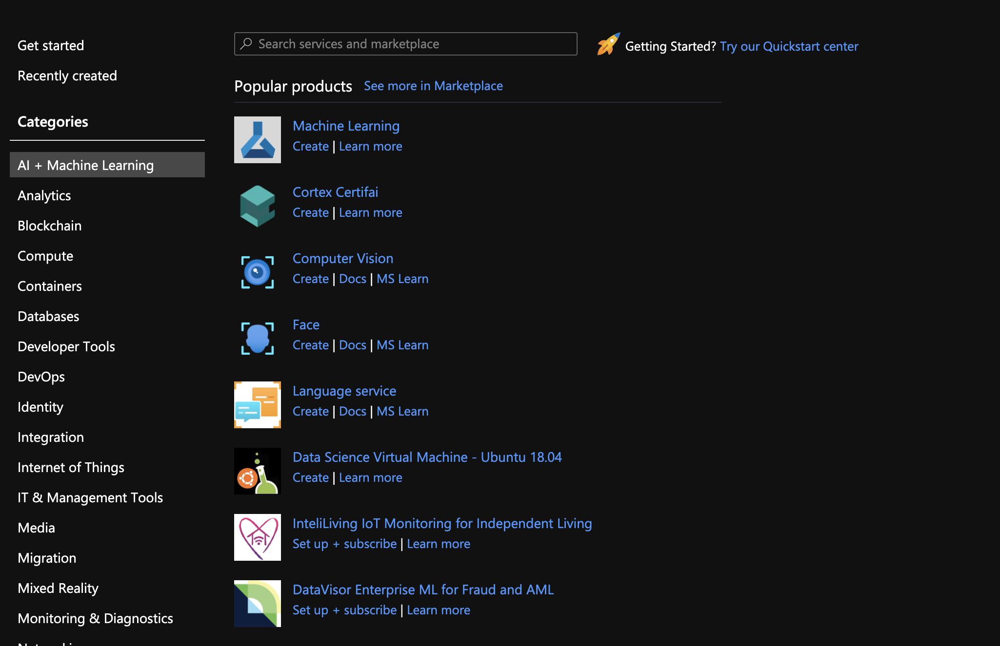
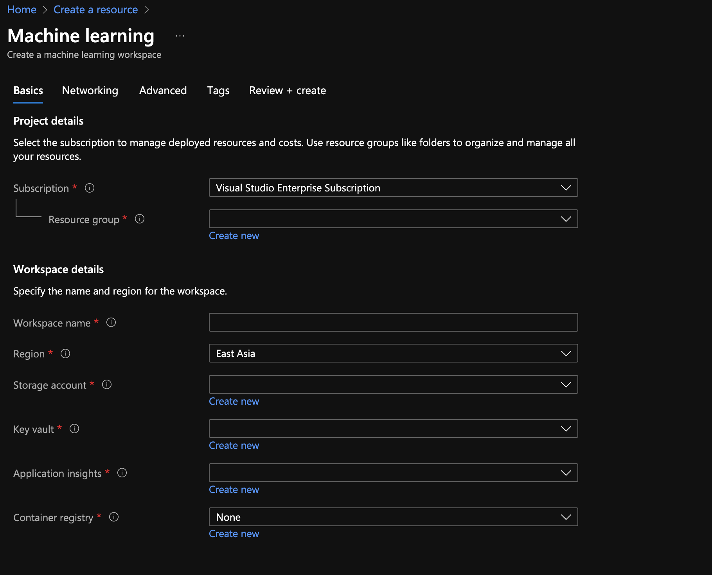
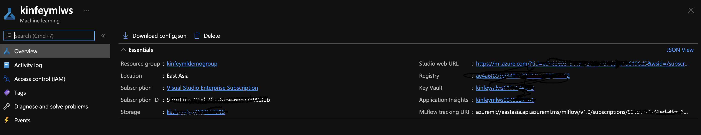
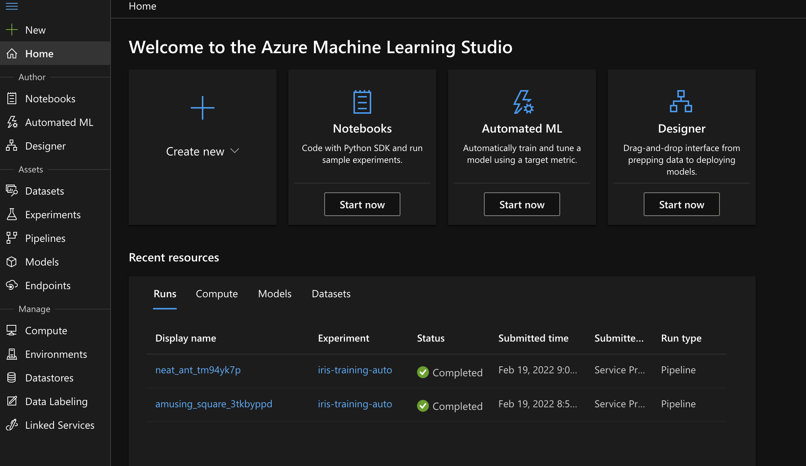

# **实验准备**

本课程基于 Azure Machine Learning Service，但也要有一定人工智能知识

## **环境配置**
 

| 工具    | 介绍 | 
| :---        |    :----:   |        
| Python     | 
这是最基本的环境，建议使用 Python 3.8.10 来作为标准的设置  安装方式: Windows 安装<a href="https://github.com/kinfey/HandsOnLab/blob/main/MLNetLab/docs/00_Install.pdf">（点击查看）</a>   macOS/Linux 安装<a href="https://github.com/kinfey/HandsOnLab/blob/main/MLNetLab/docs/00_Linux_WSL_MacOS_Install_Python.pdf">（点击查看）</a>  
    | 
| 机器学习 相关环境   | 
 Windows 环境<a href="https://blog.csdn.net/kinfey/article/details/120614677">（点击查看）</a>  macOS/Linux 安装<a href="https://blog.csdn.net/kinfey/article/details/117635067">（点击查看）</a>  
    | 
| Azure 账号   | 
免费账号申请<a href="https://azure.com/free">（点击查看）</a>  学生账号申请<a href="https://aka.ms/studentgetazure">（点击查看）</a>  
    | 
| Azure CLI    | 
 安装 Azure CLI <a href="https://docs.microsoft.com/zh-cn/cli/azure/install-azure-cli">（点击查看）</a>    
    | 
| AzureML SDK   | 
pip3 install azureml-sdk 
    | 
| GitHub   | 
GitHub <a href="https://github.com/">（点击查看）   | 

## **创建好 Azure ML 环境**
 

### **1. 进入 Azure Portal**
  
  

### **2. 点击 ‘Create Source’ 进入资源创建界面，并选择 AI + Machine Learning**
  

  

### **3. 选择 Machine Learning，创建你的 Azure ML ，选择你的订阅，填写相关信息，点击创建**

  

  

### **4. 创建成功后，进入到你的工作区**

  

  

### **5. 选择 Studio web URL 进入到 Azure ML 界面**

  

  

