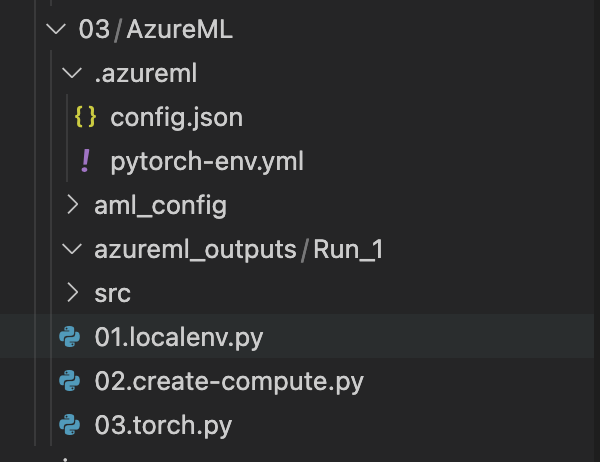
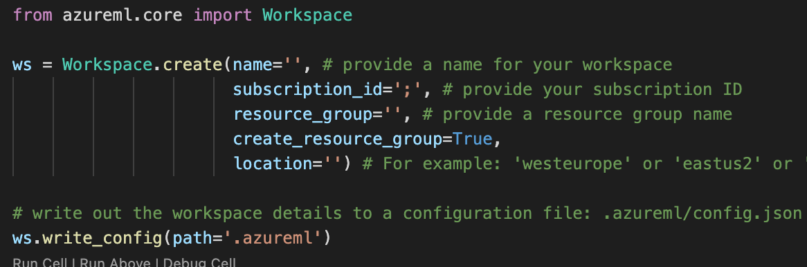
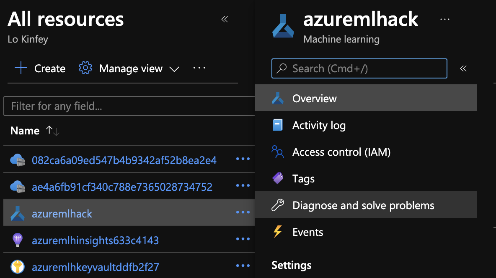
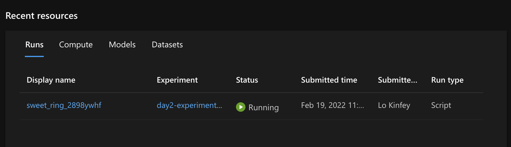
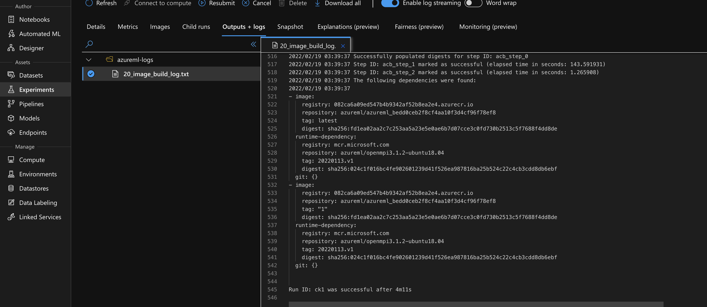

# **AzureML 的进阶**

如果你之前没有配置好本地环境，建议自己动手设置，当然你可以可以把这个运行环境专程 Notebook 放在 Azure ML  Workspace 上运行 
  

### **1. 用 Visual Studio Code 打开 code/03/ 下的 Azure ML 文件夹**
 

  

### **2. 打开 01.localenv.py 文件**

这个文件是在本地创建 Azure ML 上的 WorkSpace ，这里你可以在你的 Azure 门户上找到相应的 subscription ID 以及相关的 resource group 等 ，请根据情况自行填写 

 

  

创建成功，你可以在你 Azure 门户上，看到你新创建的 Azure ML WorkSpace

 

  

### **3. 依次执行02，03 文件 ，你可以发现，Azure ML 可以帮你解决一之前想到的 AI/ML 的问题**

通过运行，点击Azure ML WorkSpace 你可以看到很多对应的运行信息，包括 Pipline ，Model 等。

 

  
 

  

