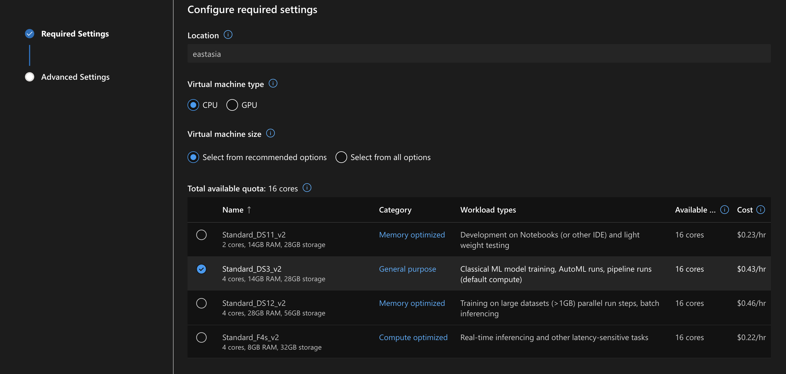

# **Azure ML 介绍**

Azure 机器学习是一种用于加速和管理机器学习项目生命周期的云服务。 机器学习专业人员、数据科学家和工程师可以在日常工作流中使用它：训练和部署模型，以及管理 MLOps。

可以在 Azure 机器学习中创建模型，也可以使用从开源平台构建的模型，例如 Pytorch、TensorFlow 或 scikit-learn。 MLOps 工具有助于监视、重新训练和重新部署模型。
  
  

## **Azure ML Studio介绍**

 
Azure ML Studio 介绍是一种图形用户界面，用作项目工作区。 在工作室中，可以执行以下操作：

查看运行、指标、日志、输出等。

创作和编辑笔记本和文件。

管理公共资产，例如, 数据凭据/计算/环境

直观呈现运行指标、结果和报表。

直观呈现通过开发人员界面创作的管道。

创作 AutoML 作业。  

  

我们来尝试下用 Azure ML Studio 来创建做一些实验
  

#### **1. 选择 Notebooks** 

 

  

#### **2. 上传 code/02 文件下的文件到 Notebooks** 
 

  

#### **3. 点击 sample01.ipynb Notebooks ** 
 

  

选择 Compute 创建一个运算容器
 

  

如果你之前已经创建就用回之前的，如果没有就创建，因为这是动手实验所以建议选最简单的，我这里用 CPU 
 

  

创建完后，你就可以启用你的算力 

  

当 Compute 状态变为 Runnning，你需要选择运行环境，请使用 Python 3.6 来作为你的运行环境

  

