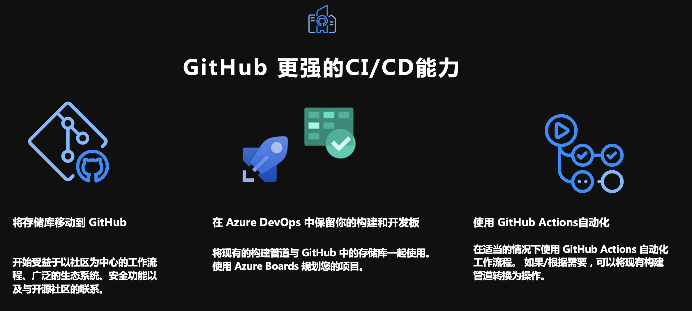
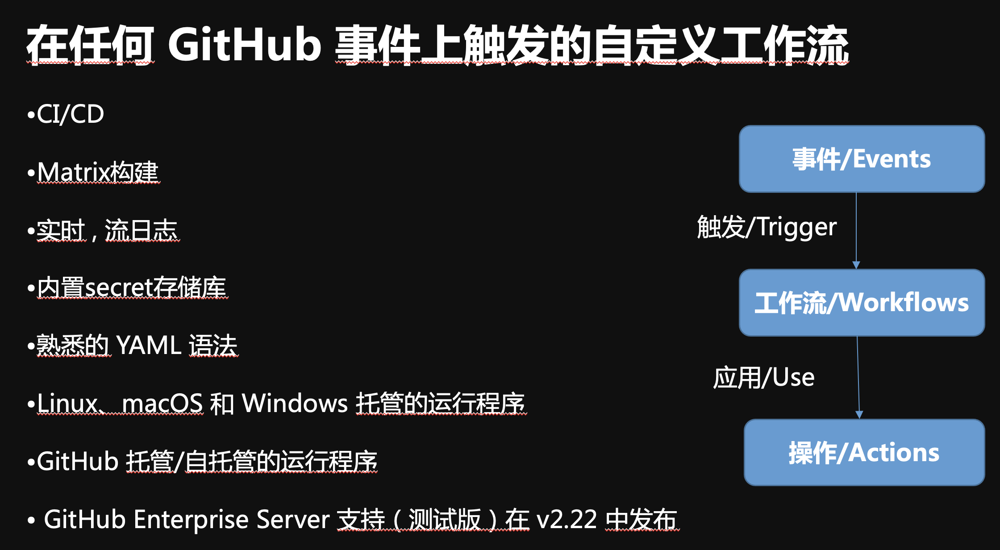
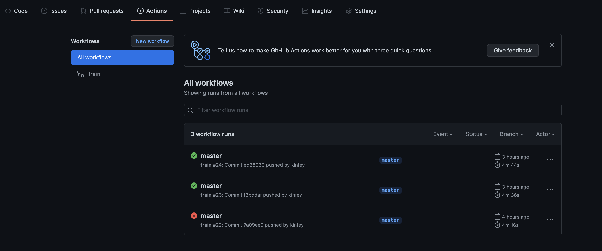

# **Github Action 介绍**

<br/><br/>
<br/><br/>

GitHub Actions 可让您轻松自动化所有软件工作流程，现在使用世界一流的 CI/CD。 直接从 GitHub 构建、测试和部署您的代码。 让代码审查、分支管理和问题分类以您想要的方式工作。


<br/><br/>


## **Github Action 的功能**

从图你可以看到 GitHub Action 基本上完成了整个开发周期的自动化



<br/><br/>


## **如何写 Github Action？**

<br/>
在项目上添加.github/workflows 下添加yaml文件<br/><br/>


```yaml

name: train
on: [push]
jobs:
  run:
    runs-on: [ubuntu-latest]
    container: docker://dvcorg/cml-py3:latest
    steps:
      - uses: actions/checkout@v2
      - name: train_pipeline
        env:
          
          AZUREML_CLIENTID: ${{secrets.AZUREML_CLIENTID}}
          AZUREML_TENANTID: ${{secrets.AZUREML_TENANTID}}
          AZUREML_SECRET: ${{secrets.AZUREML_SECRET}}
          AZUREML_SUBSCRIPTION: ${{secrets.AZUREML_SUBSCRIPTION}}
          AZUREML_RESOURCE_GROUP: ${{secrets.AZUREML_RESOURCE_GROUP}}
          AZUREML_WORKSPACE: ${{secrets.AZUREML_WORKSPACE}}
        run: |
          # Your ML workflow goes here
          pip install -r requirements.txt
          python iris_train_pipeline.py
          # echo "supervised learning output"
          # cat output.txt

```


通过 GitHub Action 的 CI / CD 操作


<br/>

<br/><br/>


## **如何打通 Azure**

通过项目在 GitHub 上的设置，配置好与Azure 相关的Key，如AZUREML_CLIENTID， AZUREML_RESOURCE_GROUP， AZUREML_SECRET， AZUREML_SUBSCRIPTION，AZUREML_TENANTID
，AZUREML_WORKSPACE

获取方式你可以通过以下命令获取

```bash

az ad sp create-for-rbac --sdk-auth --name ml-auth 

```

<div style="color: Red">如果你还没有完成相关的环境配置，请参照 01.Prepare ，安装</div>