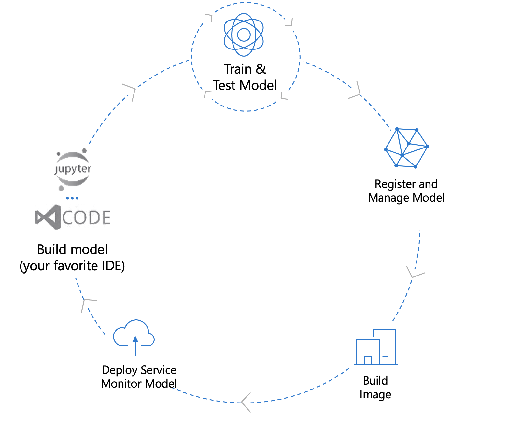
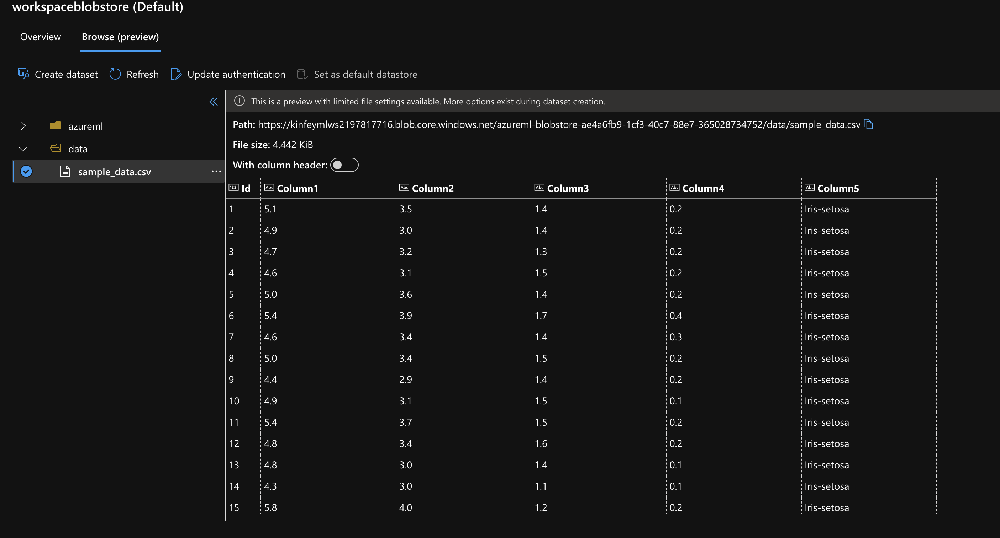
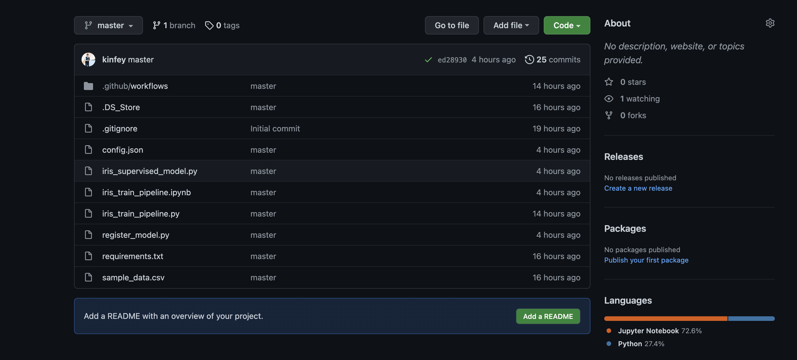
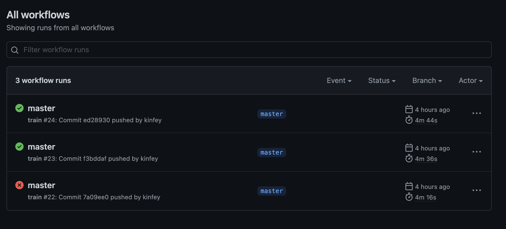
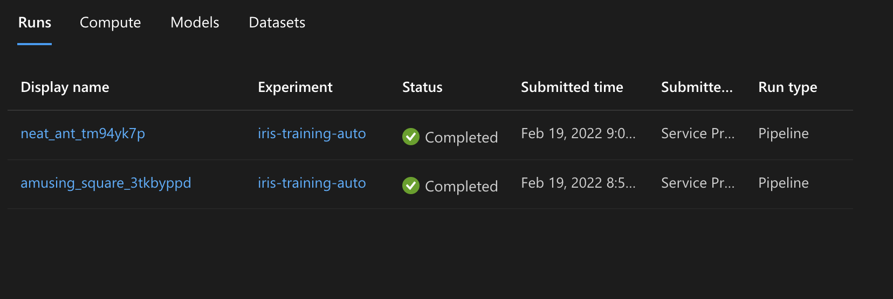
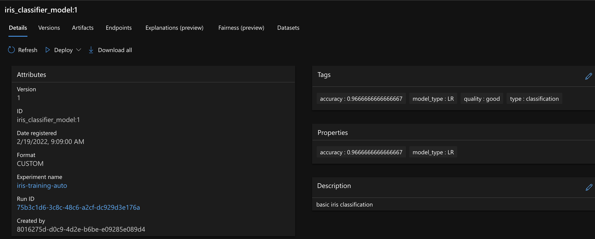

# **Github Action + AzureML**

下载05文件夹的代码，在 GitHub 创建一个 New Repository ， 并更新代码执行体验 MLOps 的过程

通过该例子你可以充分体会相关的MLOps过程从数据管理，训练，测试，到部署

 

  

### **数据整理**

 

  

### **代码管理**

 

  

### **CI / CD操作**

 

  

### **训练过程监控**

 

  

### **模型部署**

 

  

