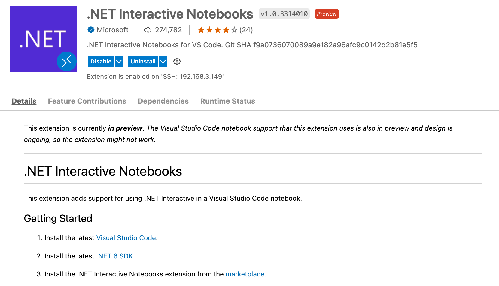

# **一. TorchSharp 环境安装**

要使用 TorchSharp，需要使用来自 NuGet 的包。

首先，您需要在 https://www.nuget.org/packages/TorchSharp/ 下载最新版本的 TorchSharp 包。 这是与 libtorch 的 .NET 绑定，它包含 .NET API。 还需要 libtorch 。

基本后端支持在 CPU 上进行训练和推理，但也支持 Windows 和 Linux 上的 CUDA，以便在具有兼容硬件的机器上使用。 使用 CUDA 进行训练可以将速度提高几个数量级。 选择合适的环境非常重要，个人建议在 WSL / Linux 环境下进行机器学习

|包|链接|描述|
|-----|-----------------|--------------|
|TorchSharp-cpu|https://www.nuget.org/packages/TorchSharp-cpu/|TorchSharp 纯 CPU 支持 , 可以在 Windows / Linux / MacOS 下运行 |
|TorchSharp-cuda-windows|https://www.nuget.org/packages/TorchSharp-cuda-windows/| Windows CUDA 环境支持 |
|TorchSharp-cuda-linux|https://www.nuget.org/packages/TorchSharp-cuda-linux/| Linux CUDA 环境支持|

本次课程基于 Visual Studio Code +  .NET Interactive 环境，例子以 Linux / WSL 环境为主。 当然你也可以使用 Windows 作为你的开发环境。 


### **1. 在 Visual Studio Code 安装 .NET Interactive 的插件**



### **2. WSL / Linux CUDA / CUDNN 环境安装，请参考**

1. WSL 环境安装 https://blog.csdn.net/kinfey/article/details/120614677

2. Linux 环境安装 https://blog.csdn.net/kinfey/article/details/117635067

### **3. 环境测试**


```C#
#r "nuget: TorchSharp"
```


<div><div></div><div></div><div><strong>Installed Packages</strong><ul><li><span>TorchSharp, 0.96.7</span></li></ul></div></div>


```C#
#r "nuget: libtorch-cuda-11.3-linux-x64"
```


<div><div></div><div></div><div><strong>Installed Packages</strong><ul><li><span>libtorch-cuda-11.3-linux-x64, 1.11.0.1</span></li></ul></div></div>


```C#
using TorchSharp;
```


```C#
using static TorchSharp.torch;
```

#### **是否有效cuda**


```C#
torch.cuda.is_available()
```


<div class="dni-plaintext">True</div>


```C#
torch.cuda.device_count()
```


<div class="dni-plaintext">2</div>


```C#
torch.cuda.is_cudnn_available()
```


<div class="dni-plaintext">True</div>


```C#
var device = cuda.is_available() ? CUDA : CPU;
```


```C#
device
```


<table><thead><tr><th>type</th><th>index</th></tr></thead><tbody><tr><td><div class="dni-plaintext">CUDA</div></td><td><div class="dni-plaintext">-1</div></td></tr></tbody></table>

